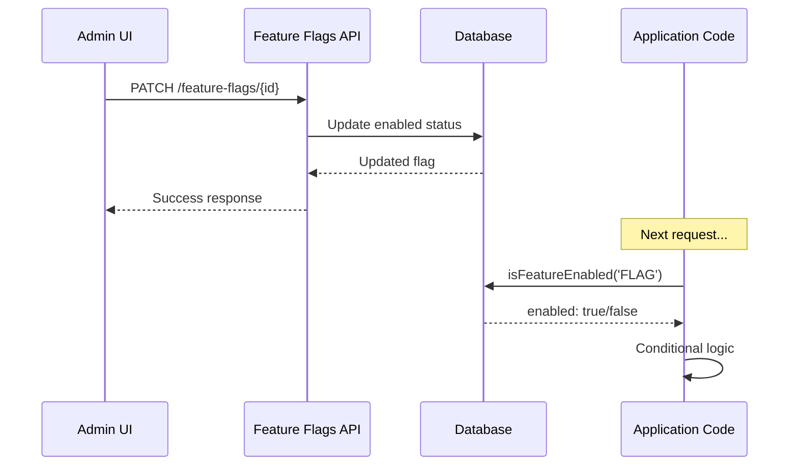

# Feature Flags

## Overview

The feature flag system enables runtime control of application features without redeployment. Flags are stored in the database and can be toggled instantly by administrators, supporting use cases like maintenance mode, gradual rollouts, and A/B testing.

## Use Cases

- **Maintenance Mode**: Show maintenance page to non-admin users
- **Feature Rollouts**: Gradually enable new features
- **Kill Switches**: Quickly disable problematic features
- **A/B Testing**: Control feature variants
- **Beta Features**: Gate access to experimental functionality

## Flag Naming Convention

Flags use **SCREAMING_SNAKE_CASE** format:

```
MAINTENANCE_MODE
ENABLE_DARK_MODE
NEW_DASHBOARD
BETA_ANALYTICS
```

Validation enforces this pattern:

```typescript
const featureFlagNameSchema = z.string().regex(/^[A-Z][A-Z0-9]*(?:_[A-Z0-9]+)*$/);
```

## Components

### FeatureFlagList

**Location**: `components/admin/feature-flag-list.tsx`

Displays flags in a table with:

- **Name** (clickable to edit)
- **Description**
- **Toggle switch** for quick enable/disable
- **Creation date**
- **Delete button**

**Props**:

```typescript
interface FeatureFlagListProps {
  initialFlags: FeatureFlag[];
  onCreateClick: () => void;
  onEditClick: (flag: FeatureFlag) => void;
}
```

### FeatureFlagsPage

**Location**: `components/admin/feature-flags-page.tsx`

Client-side page wrapper that serves as the main entry point for feature flag management. Used by `app/admin/features/page.tsx`.

**Responsibilities**:

- Fetches and manages flag state on mount
- Coordinates between FeatureFlagList and FeatureFlagForm components
- Handles create/edit form visibility
- Updates local state after flag create/update operations

**State Management**:

```typescript
const [flags, setFlags] = useState<FeatureFlag[]>([]);
const [isLoading, setIsLoading] = useState(true);
const [showForm, setShowForm] = useState(false);
const [editingFlag, setEditingFlag] = useState<FeatureFlag | null>(null);
```

**Callbacks**:

- `handleCreateClick()` — Opens form for new flag creation
- `handleEditClick(flag)` — Opens form pre-populated with flag data
- `handleFlagSaved(flag)` — Updates local state after API success
- `handleFormClose(open)` — Closes form and resets editing state

### FeatureFlagForm

**Location**: `components/admin/feature-flag-form.tsx`

Dialog form for creating and editing flags:

| Field       | Create   | Edit     |
| ----------- | -------- | -------- |
| Name        | Editable | Disabled |
| Description | Editable | Editable |
| Enabled     | Editable | Editable |

**Validation Schema**:

```typescript
const featureFlagSchema = z.object({
  name: z
    .string()
    .min(1)
    .max(100)
    .regex(/^[A-Z][A-Z0-9]*(?:_[A-Z0-9]+)*$/),
  description: z.string().max(500).optional(),
  enabled: z.boolean(),
});
```

**Validation Notes**:

- Server-side validation uses `.transform()` to auto-convert input to uppercase
- Name must be 1-100 characters with SCREAMING_SNAKE_CASE format
- Client-side form sanitizes input in real-time before submission

## Utility Functions

**Location**: `lib/feature-flags/index.ts`

```typescript
// Check if a flag is enabled
const isEnabled = await isFeatureEnabled('MAINTENANCE_MODE');

// Get all flags
const flags = await getAllFlags();

// Get single flag
const flag = await getFlag('FEATURE_NAME');

// Toggle flag state
await toggleFlag('FEATURE_NAME', true);

// Create new flag
await createFlag({
  name: 'NEW_FEATURE',
  description: 'Description',
  enabled: false,
});

// Update flag
await updateFlag(id, { enabled: true });

// Delete flag
await deleteFlag(id);
```

## Default Flags

**Location**: `lib/feature-flags/config.ts`

Pre-configured flags seeded on application start:

```typescript
export const DEFAULT_FLAGS = [
  {
    name: 'MAINTENANCE_MODE',
    description: 'Shows maintenance page to non-admin users',
    enabled: false,
    metadata: {
      message: 'We are performing maintenance.',
      estimatedDowntime: null,
    },
  },
];
```

Type-safe flag name constants:

```typescript
import { FLAG_NAMES } from '@/lib/feature-flags/config';

if (await isFeatureEnabled(FLAG_NAMES.MAINTENANCE_MODE)) {
  // Handle maintenance mode
}
```

## API Endpoints

| Endpoint                           | Method | Purpose         |
| ---------------------------------- | ------ | --------------- |
| `/api/v1/admin/feature-flags`      | GET    | List all flags  |
| `/api/v1/admin/feature-flags`      | POST   | Create flag     |
| `/api/v1/admin/feature-flags/[id]` | GET    | Get single flag |
| `/api/v1/admin/feature-flags/[id]` | PATCH  | Update flag     |
| `/api/v1/admin/feature-flags/[id]` | DELETE | Delete flag     |

### Create Flag (POST)

```typescript
{
  name: "NEW_FEATURE",      // Required, SCREAMING_SNAKE_CASE
  description: "...",       // Optional
  enabled: false,           // Optional, default false
  metadata: { ... }         // Optional JSON object
}
```

### Update Flag (PATCH)

```typescript
{
  description: "...",       // Optional
  enabled: true,            // Optional
  metadata: { ... }         // Optional
}
```

Note: Flag names cannot be changed after creation.

## Database Schema

```prisma
model FeatureFlag {
  id          String   @id @default(cuid())
  name        String   @unique
  description String?
  enabled     Boolean  @default(false)
  metadata    Json?    @default("{}")
  createdBy   String?
  createdAt   DateTime @default(now())
  updatedAt   DateTime @updatedAt
}
```

## Usage in Application Code

```typescript
// In Server Components
import { isFeatureEnabled } from '@/lib/feature-flags';

export default async function Page() {
  if (await isFeatureEnabled('MAINTENANCE_MODE')) {
    return <MaintenancePage />;
  }
  return <NormalPage />;
}

// In API Routes
export async function GET() {
  if (await isFeatureEnabled('NEW_API')) {
    return newHandler();
  }
  return legacyHandler();
}
```

## Data Flow



## Related Documentation

- [Overview](./overview.md) - Admin dashboard architecture
- [Database Schema](../database/schema.md) - FeatureFlag model
- [API Endpoints](../api/endpoints.md) - Full API reference
