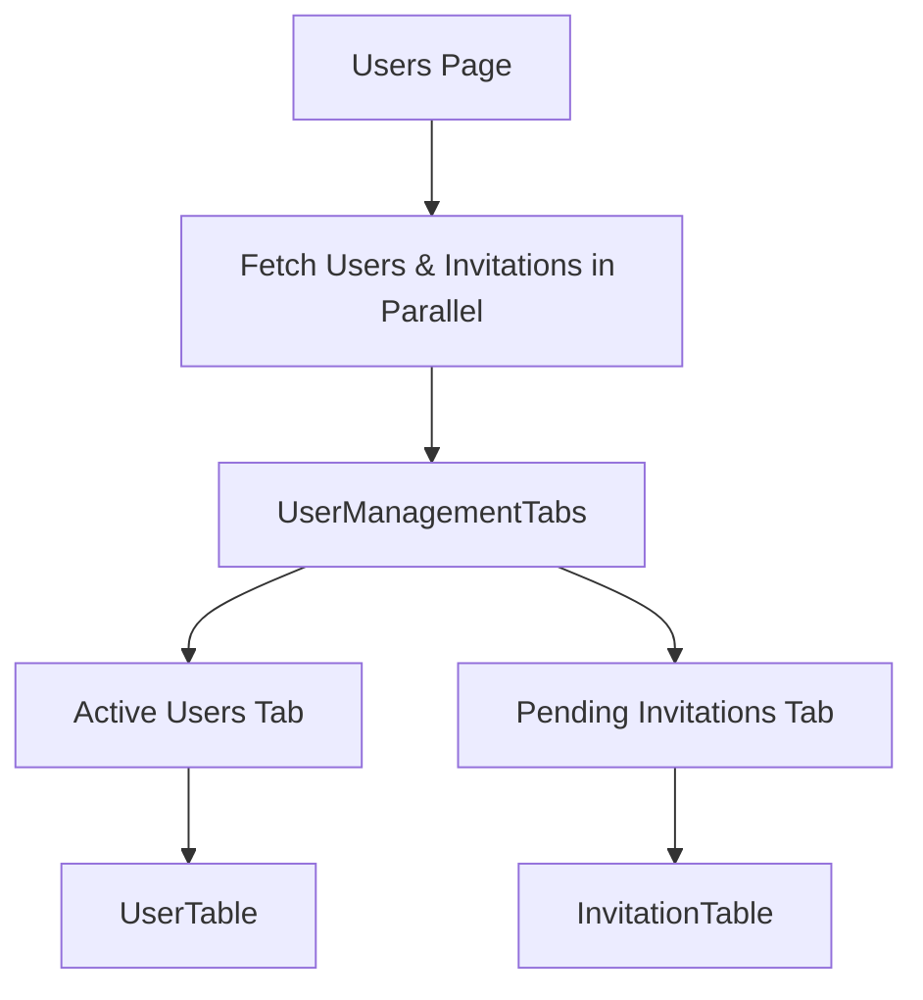
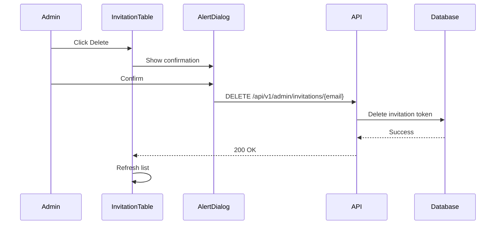
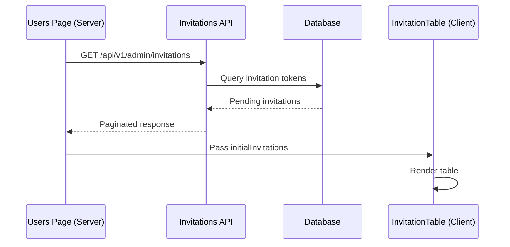

# Invitation Management

## Overview

The invitation management system allows administrators to view and manage pending user invitations. It is displayed as a tab alongside active users in the user management interface, providing a unified view of both current and prospective users.

## Features

### Invitation Listing

The `InvitationTable` component displays pending invitations with:

- **Name and email** of invited user
- **Role** to be assigned (USER or ADMIN)
- **Invited by** (admin who sent the invitation)
- **Invited date**
- **Expiration date** with "Soon" badge for invitations expiring within 24 hours
- **Action menu** (Resend, Delete)

### Search

Real-time search with 300ms debouncing across name and email fields.

### Sorting

| Column     | Sortable |
| ---------- | -------- |
| Name       | Yes      |
| Email      | Yes      |
| Role       | No       |
| Invited By | No       |
| Invited    | Yes      |
| Expires    | Yes      |

### Pagination

Server-side pagination with default 20 items per page.

## Components

### UserManagementTabs

**Location**: `components/admin/user-management-tabs.tsx`

Wrapper component that organizes users and invitations into tabs:

```typescript
interface UserManagementTabsProps {
  users: UserListItem[];
  usersMeta: PaginationMeta;
  invitations: InvitationListItem[];
  invitationsMeta: PaginationMeta;
}
```

Features:

- **Tab badges**: Shows count of users and pending invitations
- **Shared invite button**: Single "Invite User" button in header
- **Parallel data fetching**: Server component fetches both datasets concurrently



### InvitationTable

**Location**: `components/admin/invitation-table.tsx`

**Props**:

```typescript
interface InvitationTableProps {
  initialInvitations: InvitationListItem[];
  initialMeta: PaginationMeta;
  initialSearch?: string;
  initialSortBy?: 'name' | 'email' | 'invitedAt' | 'expiresAt';
  initialSortOrder?: 'asc' | 'desc';
}
```

### UserInviteForm

**Location**: `components/admin/user-invite-form.tsx`

Form component for inviting new users with name, email, and role selection.

**Features**:

- Form validation with Zod schema (name, email, role)
- Success state displaying invitation details
- Copyable invitation link with clipboard support
- "Invite Another" button to reset form for multiple invitations
- Role selection (USER or ADMIN)
- Loading and error states

**Internal Types**:

```typescript
// Form data validated by local Zod schema
interface InviteFormData {
  name: string;
  email: string;
  role: 'USER' | 'ADMIN';
}

// API response structure
interface InvitationResponse {
  message: string;
  invitation: {
    email: string;
    name: string;
    role: string;
    invitedAt: string;
    expiresAt: string;
    link?: string;
  };
  emailStatus: 'sent' | 'failed' | 'disabled' | 'pending';
}
```

## Actions

### Resend Invitation

Sends a new invitation email and resets the expiration timer:

```typescript
await apiClient.post('/api/v1/users/invite?resend=true', {
  body: {
    name: invitation.name,
    email: invitation.email,
    role: invitation.role,
  },
});
```

Provides visual feedback:

- Spinning icon during send
- Success message with 3-second auto-dismiss
- Refreshes list to show updated expiration

### Cancel Invitation

Deletes the invitation with confirmation dialog:



## Expiration Handling

Invitations expiring within 24 hours are highlighted:

```typescript
function isExpiringSoon(expiresAt: Date): boolean {
  const now = new Date();
  const twentyFourHoursFromNow = new Date(now.getTime() + 24 * 60 * 60 * 1000);
  return expiresAt <= twentyFourHoursFromNow;
}
```

Visual indicators:

- Orange text for expiration date
- "Soon" badge with clock icon

## API Endpoints

| Endpoint                            | Method | Purpose                  |
| ----------------------------------- | ------ | ------------------------ |
| `/api/v1/admin/invitations`         | GET    | List pending invitations |
| `/api/v1/admin/invitations/[email]` | DELETE | Cancel invitation        |
| `/api/v1/users/invite`              | POST   | Send/resend invitation   |

### Query Parameters (GET /api/v1/admin/invitations)

| Parameter   | Type     | Default   | Description              |
| ----------- | -------- | --------- | ------------------------ |
| `page`      | number   | 1         | Page number              |
| `limit`     | number   | 20        | Items per page (max 100) |
| `search`    | string   | -         | Search name/email        |
| `sortBy`    | string   | invitedAt | Sort field               |
| `sortOrder` | asc/desc | desc      | Sort direction           |

## Validation Schemas

**Location**: `lib/validations/admin.ts`

### listInvitationsQuerySchema

Validates query parameters for `GET /api/v1/admin/invitations`:

```typescript
const listInvitationsQuerySchema = z.object({
  search: z.string().trim().max(200).optional(),
  page: z.coerce.number().int().positive().default(1),
  limit: z.coerce.number().int().positive().max(100).default(20),
  sortBy: z.enum(['name', 'email', 'invitedAt', 'expiresAt']).default('invitedAt'),
  sortOrder: z.enum(['asc', 'desc']).default('desc'),
});
```

### invitationMetadataSchema

Validates the Prisma JSON `metadata` field on `Verification` records:

```typescript
const invitationMetadataSchema = z.object({
  name: z.string(),
  role: z.string(),
  invitedBy: z.string(),
  invitedAt: z.string(),
});
```

### parseInvitationMetadata

Utility function to safely parse invitation metadata from the database:

```typescript
function parseInvitationMetadata(data: unknown): InvitationMetadata | null;
```

Returns the validated metadata object or `null` if the data doesn't match the expected shape (e.g., corrupted or legacy data). Use this instead of bare `as InvitationMetadata` type assertions.

## Type Definitions

```typescript
// types/index.ts
export interface InvitationListItem {
  email: string;
  name: string;
  role: string;
  invitedBy: string;
  invitedByName: string | null;
  invitedAt: Date;
  expiresAt: Date;
}
```

## Data Flow



## Related Documentation

- [User Management](./user-management.md) - Active user management
- [Overview](./overview.md) - Admin dashboard architecture
- [User Creation](../auth/user-creation.md) - Invitation flow details
- [Email Templates](../email/overview.md) - Invitation email template
