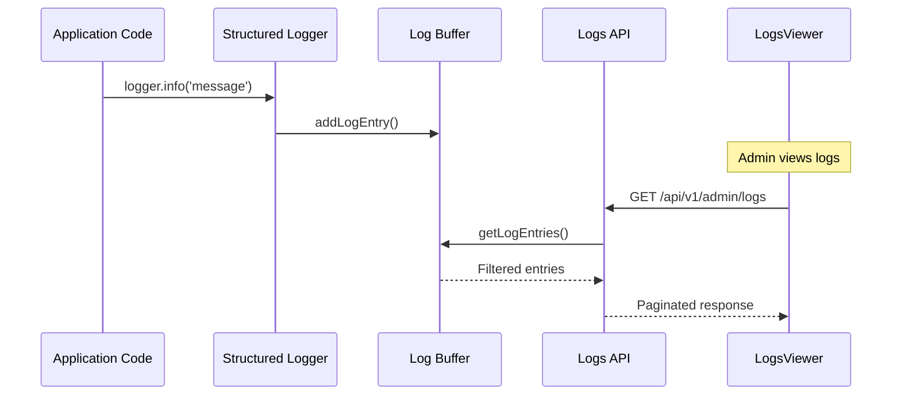

# Logs Viewer

## Overview

The logs viewer (`/admin/logs`) provides administrators with real-time access to application logs. It uses an in-memory ring buffer to store recent log entries, supporting filtering by level, text search, and pagination.

## Features

### Log Display

Each log entry shows:

- **Level badge** with color-coded icon (error/warn/info/debug)
- **Message** text
- **Timestamp**
- **Expandable details** (context, metadata, error stack traces)

### Filtering by Level

Filter logs by severity:

| Level | Color  | Icon          | Description            |
| ----- | ------ | ------------- | ---------------------- |
| Error | Red    | AlertCircle   | Application errors     |
| Warn  | Yellow | AlertTriangle | Warnings               |
| Info  | Blue   | Info          | Informational messages |
| Debug | Gray   | Bug           | Debug output           |

### Search

Full-text search across:

- Log message content
- Context data (JSON)
- Metadata (JSON)

Search is debounced at 300ms to reduce server load.

### Auto-Refresh

Optional 5-second auto-refresh with visual indicator:

- Green pulsing dot when enabled
- Manual refresh button available

### Pagination

Server-side pagination with 50 items per page default.

## Components

### LogsViewer

**Location**: `components/admin/logs-viewer.tsx`

**Props**:

```typescript
interface LogsViewerProps {
  initialLogs: LogEntry[];
  initialMeta: PaginationMeta;
}
```

### LogEntryItem

Internal component rendering individual log entries:

- Simple rows for logs without details
- Accordion rows for logs with context/metadata/errors

```typescript
// Entries with no extra data render as simple rows
if (!hasDetails) {
  return <div className="border-b px-4 py-3">{entryContent}</div>;
}

// Entries with details render as accordion items
return (
  <AccordionItem value={entry.id}>
    <AccordionTrigger>{entryContent}</AccordionTrigger>
    <AccordionContent>
      {/* Context, metadata, error details */}
    </AccordionContent>
  </AccordionItem>
);
```

## Log Buffer Utilities

**Location**: `lib/admin/logs.ts`

In-memory ring buffer with 1000 entry capacity:

```typescript
const MAX_BUFFER_SIZE = 1000;

// Add log entry
addLogEntry({
  timestamp: new Date().toISOString(),
  level: 'info',
  message: 'User logged in',
  context: { userId: '123' },
});

// Query logs with filtering
const { entries, total } = getLogEntries({
  level: 'error',
  search: 'failed',
  page: 1,
  limit: 50,
});

// Clear buffer
clearLogBuffer();

// Check buffer usage
const currentSize = getBufferSize(); // Current number of entries
const maxSize = getMaxBufferSize(); // Maximum capacity (1000)
```

### Buffer Monitoring

Two utility functions help monitor buffer usage:

| Function             | Returns | Description                             |
| -------------------- | ------- | --------------------------------------- |
| `getBufferSize()`    | number  | Current number of entries in the buffer |
| `getMaxBufferSize()` | number  | Maximum buffer capacity (1000)          |

Useful for dashboards or alerts when the buffer approaches capacity.

### Buffer Behavior

- **Ring buffer**: Oldest entries removed when capacity reached
- **Development persistence**: Uses `globalThis` to survive hot reloads
- **Production reset**: Buffer clears on server restart

```typescript
// Global storage for development persistence
const globalForLogs = globalThis as unknown as {
  logBuffer: LogEntry[] | undefined;
};
```

## Log Entry Structure

```typescript
interface LogEntry {
  id: string; // Unique identifier
  timestamp: string; // ISO timestamp
  level: 'debug' | 'info' | 'warn' | 'error';
  message: string; // Log message
  context?: Record<string, unknown>; // Request context
  meta?: Record<string, unknown>; // Additional metadata
  error?: {
    name: string;
    message: string;
    stack?: string;
    code?: string;
  };
}
```

## API Endpoint

### GET /api/v1/admin/logs

Returns paginated log entries with optional filtering.

**Query Parameters**:

| Parameter | Type   | Default | Description              |
| --------- | ------ | ------- | ------------------------ |
| `level`   | string | -       | Filter by log level      |
| `search`  | string | -       | Search in messages       |
| `page`    | number | 1       | Page number              |
| `limit`   | number | 50      | Items per page (max 100) |

**Response**:

```json
{
  "success": true,
  "data": [
    {
      "id": "log_42",
      "timestamp": "2024-01-15T10:30:00Z",
      "level": "info",
      "message": "User authentication successful",
      "context": { "userId": "user_123" }
    }
  ],
  "meta": {
    "page": 1,
    "limit": 50,
    "total": 250,
    "totalPages": 5
  }
}
```

## Integration with Logger

The structured logger automatically writes to the log buffer:

```typescript
// lib/logging/index.ts
import { addLogEntry } from '@/lib/admin/logs';

// Logger writes to buffer
addLogEntry({
  timestamp: new Date().toISOString(),
  level,
  message,
  context,
  meta,
  error: errorDetails,
});
```

## Production Considerations

The in-memory buffer is suitable for development and small deployments. For production at scale, consider:

1. **Log Aggregation Services**: DataDog, CloudWatch, Grafana Loki
2. **Persistent Storage**: Write to file or database
3. **External Monitoring**: Integrate with APM tools

See [Monitoring Overview](../monitoring/overview.md) and [Log Aggregation](../monitoring/log-aggregation.md) for production setup guides.

## Data Flow



## Related Documentation

- [Overview](./overview.md) - Admin dashboard architecture
- [Error Handling](../errors/overview.md) - Logging integration
- [Logging Best Practices](../errors/logging.md) - When and what to log
- [Log Aggregation](../monitoring/log-aggregation.md) - Production log services
