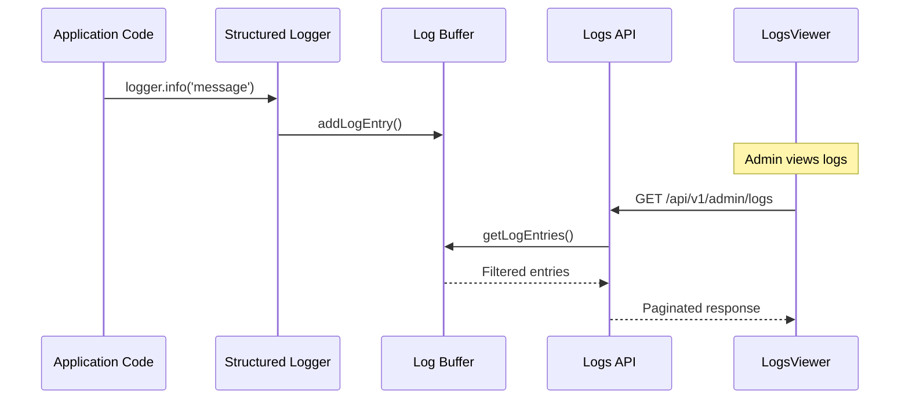

# Logs Viewer

## Overview

The logs viewer (`/admin/logs`) provides administrators with real-time access to application logs. It uses an in-memory ring buffer to store recent log entries, supporting filtering by level, text search, and pagination.

## Features

### Log Display

Each log entry shows:

- **Level badge** with color-coded icon (error/warn/info/debug)
- **Message** text
- **Timestamp**
- **Expandable details** (context, metadata, error stack traces)

### Filtering by Level

Filter logs by severity:

| Level | Color  | Icon          | Description            |
| ----- | ------ | ------------- | ---------------------- |
| Error | Red    | AlertCircle   | Application errors     |
| Warn  | Yellow | AlertTriangle | Warnings               |
| Info  | Blue   | Info          | Informational messages |
| Debug | Gray   | Bug           | Debug output           |

### Search

Full-text search across:

- Log message content
- Context data (JSON)
- Metadata (JSON)

Search is debounced at 300ms to reduce server load.

### Auto-Refresh

Optional 5-second auto-refresh with visual indicator:

- Green pulsing dot when enabled
- Manual refresh button available

### Pagination

Server-side pagination with 50 items per page default.

## Components

### LogsViewer

**Location**: `components/admin/logs-viewer.tsx`

**Props**:

```typescript
interface LogsViewerProps {
  initialLogs: LogEntry[];
  initialMeta: PaginationMeta;
}
```

### LogEntryItem

Internal component rendering individual log entries:

- Simple rows for logs without details
- Accordion rows for logs with context/metadata/errors

```typescript
// Entries with no extra data render as simple rows
if (!hasDetails) {
  return <div className="border-b px-4 py-3">{entryContent}</div>;
}

// Entries with details render as accordion items
return (
  <AccordionItem value={entry.id}>
    <AccordionTrigger>{entryContent}</AccordionTrigger>
    <AccordionContent>
      {/* Context, metadata, error details */}
    </AccordionContent>
  </AccordionItem>
);
```

## Log Buffer Utilities

**Location**: `lib/admin/logs.ts`

In-memory ring buffer with 1000 entry capacity:

```typescript
const MAX_BUFFER_SIZE = 1000;

// Add log entry
addLogEntry({
  timestamp: new Date().toISOString(),
  level: 'info',
  message: 'User logged in',
  context: { userId: '123' },
});

// Query logs with filtering
const { entries, total } = getLogEntries({
  level: 'error',
  search: 'failed',
  page: 1,
  limit: 50,
});

// Clear buffer
clearLogBuffer();

// Check buffer usage
const currentSize = getBufferSize(); // Current number of entries
const maxSize = getMaxBufferSize(); // Maximum capacity (1000)
```

### Buffer Monitoring

Two utility functions help monitor buffer usage:

| Function             | Returns | Description                             |
| -------------------- | ------- | --------------------------------------- |
| `getBufferSize()`    | number  | Current number of entries in the buffer |
| `getMaxBufferSize()` | number  | Maximum buffer capacity (1000)          |

Useful for dashboards or alerts when the buffer approaches capacity.

### Buffer Behavior

- **Ring buffer**: Oldest entries removed when capacity reached
- **Development persistence**: Uses `globalThis` to survive hot reloads
- **Production reset**: Buffer clears on server restart

```typescript
// Global storage for development persistence
const globalForLogs = globalThis as unknown as {
  logBuffer: LogEntry[] | undefined;
};
```

## Log Entry Structure

```typescript
interface LogEntry {
  id: string; // Unique identifier
  timestamp: string; // ISO timestamp
  level: 'debug' | 'info' | 'warn' | 'error';
  message: string; // Log message
  context?: Record<string, unknown>; // Request context
  meta?: Record<string, unknown>; // Additional metadata
  error?: {
    name: string;
    message: string;
    stack?: string;
    code?: string;
  };
}
```

## API Endpoint

### GET /api/v1/admin/logs

Returns paginated log entries with optional filtering.

**Query Parameters**:

| Parameter | Type   | Default | Description              |
| --------- | ------ | ------- | ------------------------ |
| `level`   | string | -       | Filter by log level      |
| `search`  | string | -       | Search in messages       |
| `page`    | number | 1       | Page number              |
| `limit`   | number | 50      | Items per page (max 100) |

**Response**:

```json
{
  "success": true,
  "data": [
    {
      "id": "log_42",
      "timestamp": "2024-01-15T10:30:00Z",
      "level": "info",
      "message": "User authentication successful",
      "context": { "userId": "user_123" }
    }
  ],
  "meta": {
    "page": 1,
    "limit": 50,
    "total": 250,
    "totalPages": 5
  }
}
```

## Whose lines a reader sees

Every entry carries the org whose request or job produced it, and the query
returns only the reading org's (§108 t-714). The buffer itself stays
process-wide — one ring, every org's lines in it — so `getBufferSize()` is the
ring's occupancy and not a count of what anyone can read. `total` in the
response is computed after the scope filter, so the pager offers a reader only
their own pages.

An entry is **unstamped** (`orgId: null`) when it was produced outside any
tenant scope: at boot, inside a `runAsSystem` job, or on a request
authenticated by a platform credential — an admin API key with no org, which
the guards run unscoped in both modes, and which is how a cron calls the
maintenance tick.

| Entry               | At `single` | At `multi`                           |
| ------------------- | ----------- | ------------------------------------ |
| stamped with an org | visible     | visible to that org only             |
| unstamped (`null`)  | visible     | visible only to a reader with no org |

**At `single` the page shows the process's lines, exactly as it always has** —
the scope rule applies at `multi`, which is where something confines it (the
same gate as the [per-org retention windows](../orchestration/retention.md#per-org-windows)).
Hiding anything at `single` would empty the page of what an operator opens it
for while protecting nothing, since there is one org. It would also not even be
safe to do narrowly: `forEachOrg` iterates every ACTIVE org in **both** modes,
so a single-mode install holding a second org stamps that org's job lines with
it, and a rule scoped to the install org would have made them vanish. At `multi` a **platform operator has no cross-org view through this
page** — that is §111's to supply, and the owner's ruling (2026-09-23) is that
it waits for it, since `multi` is not used until the phase is complete.

### What an org admin will not see at `multi`, and why

A request's **own 500 is visible** to the org that made it. The guards log
through `handleAPIError` in their outer `catch`, which sits after
`inTenantScope` has exited — so §108 t-714 re-enters the entered org around
that call. Without it the org whose request failed would have been the one org
unable to see its own error, on the page that exists for exactly that.

Two classes remain unstamped, both produced before an org is chosen and so
invisible to org admins at `multi`:

- **A refused org entry** — a non-member, or a suspended org — logged by the
  guard before any scope exists.
- **The proxy's HTTP access lines**, which run ahead of the guard entirely.

Neither is new behaviour in the logger; it is what scoping the _read_ makes
visible. Both are the platform operator's to read, which is §111's to supply.

## Integration with Logger

The structured logger automatically writes to the log buffer:

```typescript
// lib/logging/index.ts
import { addLogEntry } from '@/lib/admin/logs';

// Logger writes to buffer
addLogEntry({
  timestamp: new Date().toISOString(),
  level,
  message,
  context,
  meta,
  error: errorDetails,
});
```

The logger passes no org: `addLogEntry` reads it from the tenant context
itself, so every producer is stamped by one rule and the logging hot path
knows nothing about tenancy.

## Production Considerations

The in-memory buffer is suitable for development and small deployments. For production at scale, consider:

1. **Log Aggregation Services**: DataDog, CloudWatch, Grafana Loki
2. **Persistent Storage**: Write to file or database
3. **External Monitoring**: Integrate with APM tools

See [Monitoring Overview](../monitoring/overview.md) and [Log Aggregation](../monitoring/log-aggregation.md) for production setup guides.

## Data Flow


```mermaid
sequenceDiagram
    participant App as Application Code
    participant Logger as Structured Logger
    participant Buffer as Log Buffer
    participant API as Logs API
    participant UI as LogsViewer

    App->>Logger: logger.info('message')
    Logger->>Buffer: addLogEntry()

    Note over UI: Admin views logs
    UI->>API: GET /api/v1/admin/logs
    API->>Buffer: getLogEntries()
    Buffer-->>API: Filtered entries
    API-->>UI: Paginated response
```

## Related Documentation

- [Overview](./overview.md) - Admin dashboard architecture
- [Error Handling](../errors/overview.md) - Logging integration
- [Logging Best Practices](../errors/logging.md) - When and what to log
- [Log Aggregation](../monitoring/log-aggregation.md) - Production log services
