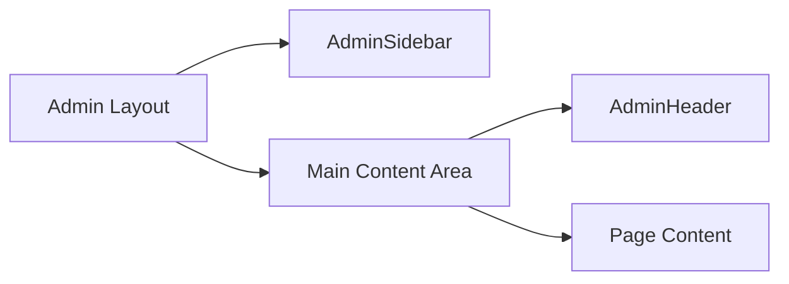

# Admin Dashboard Overview

## Purpose

The admin dashboard provides system administrators with tools to manage users, feature flags, and monitor application health. It is a dedicated route group (`/admin`) with role-based access control restricting access to users with the `ADMIN` role.

## Route Structure

```
app/admin/
├── layout.tsx          # Admin layout with sidebar/header, role check
├── page.tsx            # Redirects to /admin/overview
├── overview/
│   └── page.tsx        # Dashboard with stats and system status
├── users/
│   ├── page.tsx        # User management tabs (users + invitations)
│   ├── [id]/
│   │   └── page.tsx    # Edit individual user
│   └── invite/
│       └── page.tsx    # Send new invitation
├── features/
│   └── page.tsx        # Feature flag management
└── logs/
    └── page.tsx        # Application logs viewer
```

## Access Control

The admin layout (`app/admin/layout.tsx`) enforces role-based access:

```typescript
const session = await getServerSession();

if (!session) {
  redirect('/login'); // Unauthenticated -> login
}

if (session.user.role !== 'ADMIN') {
  redirect('/dashboard'); // Non-admin -> dashboard
}
```

All admin API endpoints (`/api/v1/admin/*`) independently verify the ADMIN role, providing defense-in-depth security.

## Layout Components



### AdminSidebar

Client component (`components/admin/admin-sidebar.tsx`) providing navigation:

- **Collapsible**: Toggle between expanded (264px) and collapsed (64px) states
- **Active state**: Highlights current route based on pathname matching
- **Sections**:
  - Overview: Dashboard
  - Management: Users, Feature Flags
  - System: Logs
- **Footer**: Link back to main dashboard

### AdminHeader

Client component (`components/admin/admin-header.tsx`) providing:

- **Breadcrumb navigation**: Auto-generated from URL pathname
- **Page title**: Derived from route or explicitly set
- **User actions**: Session controls via `HeaderActions` component

## Navigation Structure

| Route             | Label         | Description                    |
| ----------------- | ------------- | ------------------------------ |
| `/admin/overview` | Dashboard     | System stats and health status |
| `/admin/users`    | Users         | User and invitation management |
| `/admin/features` | Feature Flags | Runtime feature toggles        |
| `/admin/logs`     | Logs          | Application log viewer         |

## API Endpoints

All admin endpoints require authentication and ADMIN role:

| Endpoint                            | Method             | Purpose                  |
| ----------------------------------- | ------------------ | ------------------------ |
| `/api/v1/admin/stats`               | GET                | System statistics        |
| `/api/v1/admin/logs`                | GET                | Application logs         |
| `/api/v1/admin/feature-flags`       | GET, POST          | List/create flags        |
| `/api/v1/admin/feature-flags/[id]`  | GET, PATCH, DELETE | Manage single flag       |
| `/api/v1/admin/invitations`         | GET                | List pending invitations |
| `/api/v1/admin/invitations/[email]` | DELETE             | Cancel invitation        |

## Key Files

| File                       | Purpose                             |
| -------------------------- | ----------------------------------- |
| `types/admin.ts`           | TypeScript types for admin features |
| `lib/validations/admin.ts` | Zod schemas for validation          |
| `lib/feature-flags/`       | Feature flag utilities              |
| `lib/admin/logs.ts`        | In-memory log buffer                |

## Related Documentation

- [User Management](./user-management.md) - Managing user accounts
- [Invitations](./invitations.md) - User invitation system
- [Feature Flags](./feature-flags.md) - Runtime feature toggles
- [Logs](./logs.md) - Application log viewer
- [Stats](./stats.md) - System statistics dashboard
- [Authentication](../auth/overview.md) - Role-based access control
- [API Endpoints](../api/endpoints.md) - API documentation
