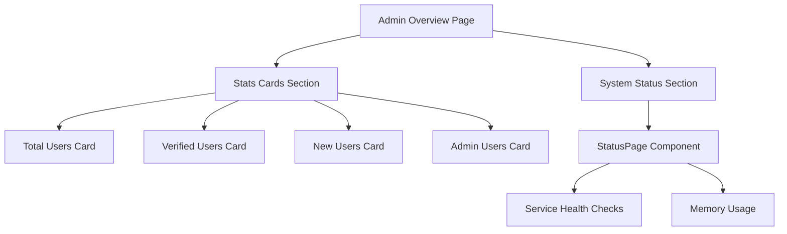

# System Stats Dashboard

## Overview

The stats dashboard (`/admin/overview`) provides administrators with a real-time overview of user metrics and system health. It combines statistics cards with the status page component to present a comprehensive view of the application state.

## Statistics Display

The `StatsCards` component displays four key metrics:

| Card            | Metric                | Description                |
| --------------- | --------------------- | -------------------------- |
| Total Users     | `users.total`         | All registered users       |
| Verified Users  | `users.verified`      | Users with verified emails |
| New Users (24h) | `users.recentSignups` | Signups in last 24 hours   |
| Admin Users     | `users.byRole.ADMIN`  | Users with admin role      |

## Component

### StatsCards

**Location**: `components/admin/stats-cards.tsx`

**Props**:

```typescript
interface StatsCardsProps {
  stats: SystemStats | null;
  isLoading?: boolean;
}
```

Features:

- **Loading skeletons**: Animated placeholders while data loads
- **Responsive grid**: 1 column on mobile, 2 on tablet, 4 on desktop
- **Calculated percentages**: Shows verification rate and role breakdown

```typescript
// Verification percentage calculation
const verificationRate = Math.round((stats.users.verified / (stats.users.total || 1)) * 100);
```

### StatCard (Internal)

Individual card component:

```typescript
interface StatCardProps {
  title: string;
  value: number | string;
  description: string;
  icon: React.ReactNode;
}
```

## System Status Integration

The overview page also includes the `StatusPage` component for real-time service monitoring:

```typescript
<StatusPage
  title="System Status"
  description="Real-time status of all services"
  pollingInterval={30000}  // 30 second refresh
  showMemory={true}
/>
```

## Data Types

### SystemStats

```typescript
interface SystemStats {
  users: {
    total: number; // Total user count
    verified: number; // Verified email count
    recentSignups: number; // Last 24 hours
    byRole: {
      USER: number;
      ADMIN: number;
    };
  };
  system: {
    nodeVersion: string; // e.g., "v20.10.0"
    appVersion: string; // From package.json
    environment: string; // "development" | "production"
    uptime: number; // Seconds since start
    databaseStatus: 'connected' | 'disconnected' | 'error';
  };
}
```

## API Endpoint

### GET /api/v1/admin/stats

Returns system statistics for the admin dashboard.

**Authentication**: Required (Admin role only)

**Response**:

```json
{
  "success": true,
  "data": {
    "users": {
      "total": 150,
      "verified": 120,
      "recentSignups": 5,
      "byRole": {
        "USER": 145,
        "ADMIN": 5
      }
    },
    "system": {
      "nodeVersion": "v20.10.0",
      "appVersion": "1.0.0",
      "environment": "production",
      "uptime": 86400,
      "databaseStatus": "connected"
    }
  }
}
```

### Implementation Details

Statistics are gathered efficiently using parallel database queries:

```typescript
const [totalUsers, verifiedUsers, recentSignups, usersByRole, dbHealth] = await Promise.all([
  prisma.user.count(),
  prisma.user.count({ where: { emailVerified: true } }),
  prisma.user.count({ where: { createdAt: { gte: twentyFourHoursAgo } } }),
  prisma.user.groupBy({ by: ['role'], _count: { role: true } }),
  getDatabaseHealth(),
]);
```

**Performance**: All queries execute in parallel, minimizing response time.

**Uptime Tracking**: Uses module-level constant to track process start time:

```typescript
const PROCESS_START_TIME = Date.now();
// ...
uptime: Math.floor((Date.now() - PROCESS_START_TIME) / 1000);
```

## Page Layout



## Server-Side Data Fetching

The page uses server-side data fetching with cookie forwarding:

```typescript
async function getStats(): Promise<SystemStats | null> {
  const cookieStore = await cookies();
  const cookieHeader = cookieStore
    .getAll()
    .map((c) => `${c.name}=${c.value}`)
    .join('; ');

  const res = await fetch(`${process.env.BETTER_AUTH_URL}/api/v1/admin/stats`, {
    headers: { Cookie: cookieHeader },
    cache: 'no-store',
  });
  // ...
}
```

## Error Handling

Graceful degradation when stats unavailable:

- Returns `null` on fetch failure
- `StatsCards` renders loading skeletons when `stats` is `null`
- No error thrown to user - dashboard remains functional

## Related Documentation

- [Overview](./overview.md) - Admin dashboard architecture
- [Health Checks](../monitoring/health-checks.md) - StatusPage component
- [Monitoring Overview](../monitoring/overview.md) - System monitoring
- [API Endpoints](../api/endpoints.md) - Full API reference
