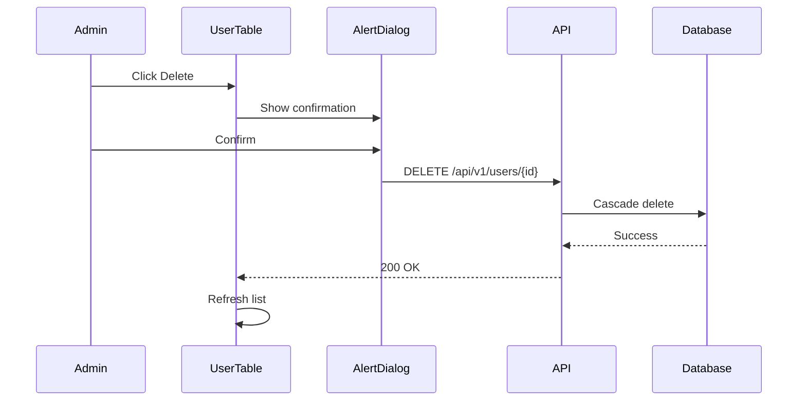

# User Management

## Overview

The user management page (`/admin/users`) provides administrators with tools to view, search, edit, and delete user accounts. It uses a tabbed interface to separate active users from pending invitations.

## Features

### User Listing

The `UserTable` component displays users with:

- **Avatar and name display**
- **Email address**
- **Role badge** (USER or ADMIN)
- **Email verification status** (checkmark or X icon)
- **Creation date**
- **Action menu** (Edit, Delete)

### Search

Real-time search with 300ms debouncing across user name and email fields:

```typescript
const handleSearch = (value: string) => {
  setSearch(value);
  searchTimeoutRef.current = setTimeout(() => {
    void fetchUsers(1, { search: value });
  }, 300);
};
```

### Sorting

Sortable columns with visual indicators:

| Column   | Sortable |
| -------- | -------- |
| Name     | Yes      |
| Email    | Yes      |
| Role     | No       |
| Verified | No       |
| Created  | Yes      |

### Pagination

Server-side pagination with configurable page size (default: 20 items):

```typescript
const DEFAULT_PAGE_LIMIT = 20;
```

## User Editing

The edit page (`/admin/users/[id]`) uses `UserEditForm` to modify:

| Field          | Editable | Notes                             |
| -------------- | -------- | --------------------------------- |
| Name           | Yes      | 1-100 characters                  |
| Role           | Yes      | USER or ADMIN (disabled for self) |
| Email Verified | Yes      | Toggle switch                     |
| Email          | No       | Display only                      |

**Self-modification protection**: Admins cannot change their own role to prevent accidental lockout.

```typescript
const isCurrentUser = user.id === currentUserId;
// Role select is disabled when isCurrentUser is true
```

## User Deletion

Deletion requires confirmation dialog and removes:

- User record
- All associated sessions
- All linked accounts (OAuth)



## Components

### UserTable

**Location**: `components/admin/user-table.tsx`

**Props**:

```typescript
interface UserTableProps {
  initialUsers: UserListItem[];
  initialMeta: PaginationMeta;
  initialSearch?: string;
  initialSortBy?: string;
  initialSortOrder?: 'asc' | 'desc';
  hideInviteButton?: boolean;
}
```

### UserEditForm

**Location**: `components/admin/user-edit-form.tsx`

**Props**:

```typescript
interface UserEditFormProps {
  user: AdminUser;
  currentUserId: string;
}
```

**Validation Schema**:

```typescript
const userEditSchema = z.object({
  name: z.string().min(1).max(100),
  role: z.enum(['USER', 'ADMIN']),
  emailVerified: z.boolean(),
});
```

## API Endpoints

| Endpoint             | Method | Purpose                    |
| -------------------- | ------ | -------------------------- |
| `/api/v1/users`      | GET    | List users with pagination |
| `/api/v1/users/[id]` | GET    | Get single user details    |
| `/api/v1/users/[id]` | PATCH  | Update user (admin only)   |
| `/api/v1/users/[id]` | DELETE | Delete user (admin only)   |

### Query Parameters (GET /api/v1/users)

| Parameter   | Type     | Default   | Description              |
| ----------- | -------- | --------- | ------------------------ |
| `page`      | number   | 1         | Page number              |
| `limit`     | number   | 20        | Items per page (max 100) |
| `search`    | string   | -         | Search name/email        |
| `sortBy`    | string   | createdAt | Sort field               |
| `sortOrder` | asc/desc | desc      | Sort direction           |

## Type Definitions

```typescript
// types/admin.ts
export type AdminUser = Pick<
  User,
  | 'id'
  | 'name'
  | 'email'
  | 'emailVerified'
  | 'image'
  | 'role'
  | 'createdAt'
  | 'updatedAt'
  | 'phone'
  | 'timezone'
  | 'location'
>;

export interface AdminUserUpdateInput {
  name?: string;
  role?: 'USER' | 'ADMIN';
  emailVerified?: boolean;
}
```

## Related Documentation

- [Invitations](./invitations.md) - User invitation management
- [Overview](./overview.md) - Admin dashboard architecture
- [Authentication](../auth/overview.md) - User roles and permissions
- [API Endpoints](../api/endpoints.md) - Full API reference
