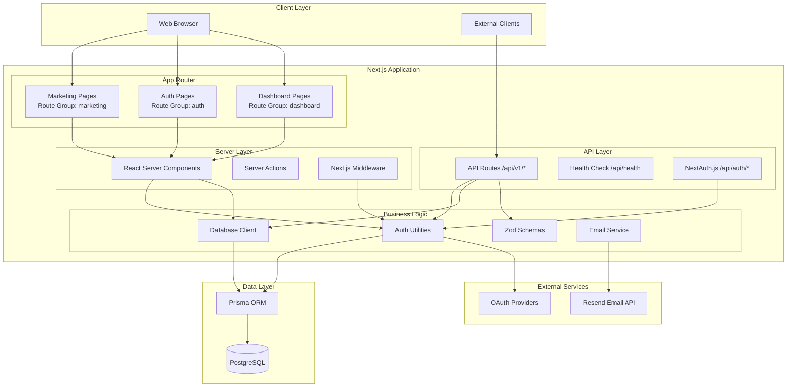
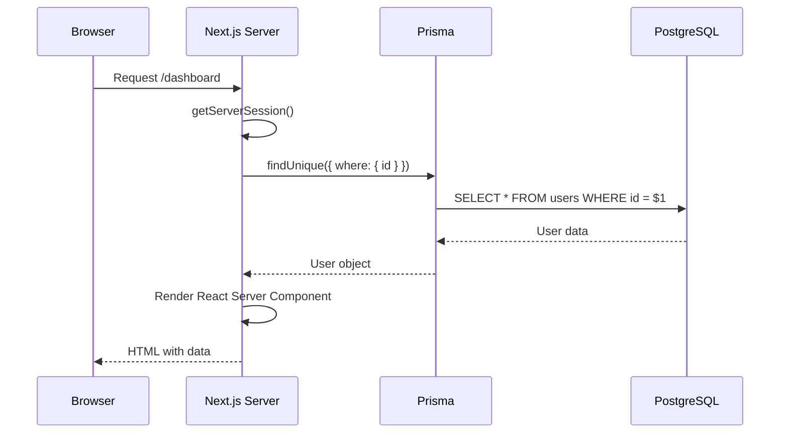
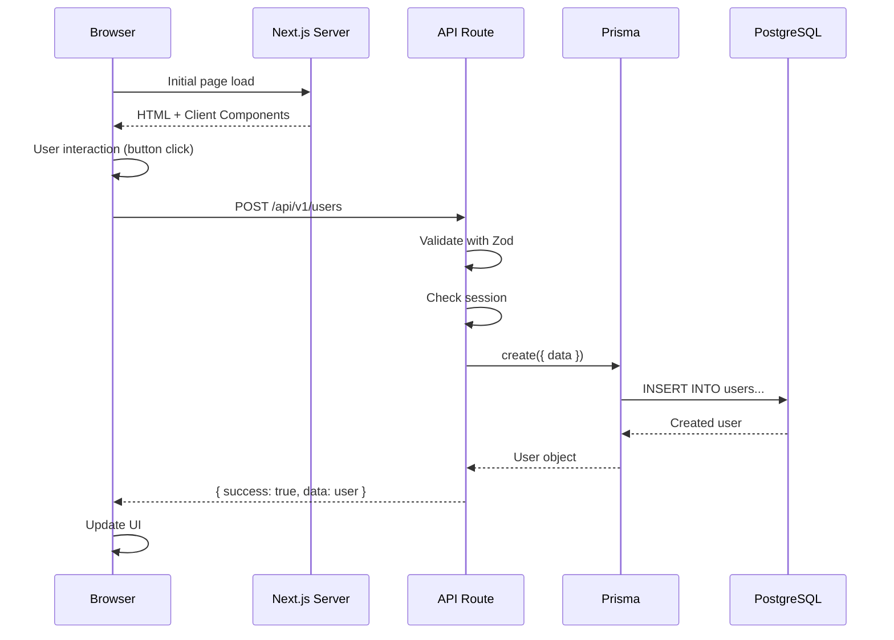
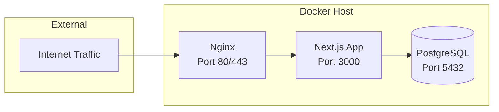

# Architecture Overview

## System Architecture

Sunrise implements a **monolithic architecture** using Next.js 14+ with the App Router pattern. The system separates concerns through route groups, server/client component boundaries, and a versioned API layer for external access.

### High-Level Architecture



## Component Boundaries

### Route Groups (Pages)

Route groups organize pages without affecting URL structure. Each group has its own layout and shared logic:

**`app/(marketing)/`** - Public pages
- Landing page, about, contact
- No authentication required
- SEO-optimized
- Marketing layout with header/footer

**`app/(auth)/`** - Authentication flows
- Login, signup, password reset, email verification
- Unauthenticated users only (redirect if logged in)
- Minimal layout, centered forms
- Form validation with Zod

**`app/(dashboard)/`** - Protected application
- User dashboard, profile, settings
- Requires authentication (protected by middleware)
- Application layout with navigation
- Server-side session checks

### Server vs. Client Components

**Server Components** (default):
```typescript
// app/(dashboard)/dashboard/page.tsx
// Server component - runs on server, no 'use client' directive
export default async function DashboardPage() {
  const session = await getServerSession(authOptions);
  const user = await prisma.user.findUnique({
    where: { id: session.user.id }
  });

  return <DashboardContent user={user} />;
}
```

**Benefits**: Direct database access, reduced client JS, better SEO, automatic code splitting

**Client Components**:
```typescript
// components/forms/login-form.tsx
'use client'

import { useForm } from 'react-hook-form';
import { signIn } from 'next-auth/react';

export function LoginForm() {
  const form = useForm<LoginFormValues>({
    resolver: zodResolver(loginSchema)
  });

  // Interactive form with hooks
  return <form onSubmit={form.handleSubmit(onSubmit)}>...</form>;
}
```

**Use When**: Forms, event handlers, browser APIs, React hooks, real-time features

### API Layer Design

API routes (`app/api/`) provide RESTful endpoints for external clients and client-side operations:

```typescript
// app/api/v1/users/route.ts
import { NextRequest } from 'next/server';
import { getServerSession } from 'next-auth';

export async function GET(request: NextRequest) {
  const session = await getServerSession(authOptions);

  if (!session) {
    return Response.json(
      { success: false, error: { message: 'Unauthorized' } },
      { status: 401 }
    );
  }

  const users = await prisma.user.findMany();

  return Response.json({
    success: true,
    data: users,
    meta: { count: users.length }
  });
}
```

**Versioning**: All public APIs use `/api/v1/` prefix for future compatibility
**Authentication**: Session-based using NextAuth.js
**Responses**: Standardized `{ success, data, error }` format

## Data Flow Patterns

### Server Component Data Flow


**Performance**: Single round-trip, no waterfall requests, automatic caching

### Client-Side API Flow


**Use Cases**: Mutations from client, external API access, client-side data fetching

## Deployment Architecture

### Production Stack (Docker)



**Container Details**:
- **Nginx**: Reverse proxy, SSL termination, static asset serving
- **Next.js**: Standalone build (~100MB image), Node.js 20 Alpine, non-root user
- **PostgreSQL**: Persistent volume, automated backups, connection pooling

### Scaling Strategy

**Current**: Single server, vertical scaling (increase CPU/RAM)
**Reasoning**: Monolithic architecture optimized for small-to-medium load

**Future Horizontal Scaling** (if needed):
1. Extract API routes to separate service
2. Add load balancer (multiple Next.js instances)
3. Implement session store (Redis) for stateless instances
4. Add database read replicas
5. CDN for static assets

**Decision Rationale**: Start simple, scale when needed. Premature distribution adds complexity without benefits at current scale.

## Decision History & Trade-offs

### Monolith vs. Microservices
**Decision**: Single Next.js application
**Rationale**:
- Faster development (shared code, types)
- Simpler deployment (one container)
- Reduced operational complexity
- Lower latency (no network calls between services)

**Trade-offs**:
- Harder to scale individual components independently
- All code in single repository (could become large)
- Technology choices affect entire system

**Mitigation**: Clear separation of concerns, modular code organization, API versioning for future extraction

### Server Components as Default
**Decision**: Use React Server Components by default, client components only when needed
**Rationale**:
- Reduced client-side JavaScript (faster page loads)
- Direct database access (no API layer needed for pages)
- Better SEO (fully rendered HTML)
- Simplified data fetching (no useEffect waterfalls)

**Trade-offs**:
- Learning curve for developers used to SPA patterns
- Some libraries incompatible with server components
- Requires careful boundary management

**Mitigation**: Clear guidelines on when to use client components, comprehensive examples

### Route Groups for Organization
**Decision**: Use route groups `(groupName)` vs. nested folders
**Rationale**:
- Cleaner URLs (groups don't appear in path)
- Shared layouts per context (marketing vs. dashboard)
- Clear separation of concerns
- Easier to apply middleware selectively

**Trade-offs**: Non-obvious to developers unfamiliar with Next.js 14+

**Mitigation**: Documentation, consistent naming conventions

## Performance Considerations

### Built-in Optimizations
- **Automatic Code Splitting**: Each route only loads required JavaScript
- **Image Optimization**: Next.js Image component with WebP conversion
- **Font Optimization**: Automatic font subsetting and preloading
- **Static Generation**: Pre-render marketing pages at build time
- **Streaming**: Progressive page rendering with React Suspense

### Caching Strategy
```typescript
// Server component with caching
export const revalidate = 3600; // Revalidate every hour

export default async function ProductsPage() {
  const products = await prisma.product.findMany();
  return <ProductList products={products} />;
}
```

**ISR (Incremental Static Regeneration)**: Pre-rendered pages with periodic updates
**On-Demand Revalidation**: Cache invalidation via API calls when data changes

### Database Query Optimization
- Connection pooling (Prisma default: 10 connections)
- Index strategy on frequently queried fields
- Select only needed fields (`select: { id: true, name: true }`)
- Eager loading with `include` to prevent N+1 queries

## Security Architecture

### Defense in Depth

**Layer 1 - Network**: HTTPS only, security headers (CSP, HSTS, X-Frame-Options)
**Layer 2 - Authentication**: NextAuth.js with secure session management
**Layer 3 - Authorization**: Role-based access control, route protection via middleware
**Layer 4 - Input Validation**: Zod schemas on all API inputs
**Layer 5 - Data Access**: Prisma (parameterized queries prevent SQL injection)
**Layer 6 - Output Encoding**: React's XSS protection, Content-Security-Policy headers

### Middleware Protection
```typescript
// middleware.ts
export function middleware(request: NextRequest) {
  const token = await getToken({ req: request });

  // Protect dashboard routes
  if (request.nextUrl.pathname.startsWith('/dashboard')) {
    if (!token) {
      return NextResponse.redirect(new URL('/login', request.url));
    }
  }

  // Add security headers
  const response = NextResponse.next();
  response.headers.set('X-Frame-Options', 'DENY');
  return response;
}
```

## Related Documentation

- [Dependencies](./dependencies.md) - Dependency injection and package management
- [Patterns](./patterns.md) - Code organization and error handling patterns
- [Auth Integration](../auth/integration.md) - NextAuth.js integration details
- [API Endpoints](../api/endpoints.md) - API route documentation
