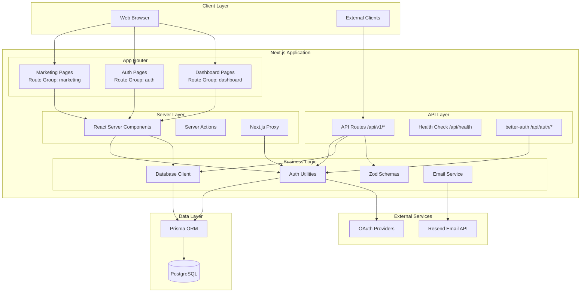
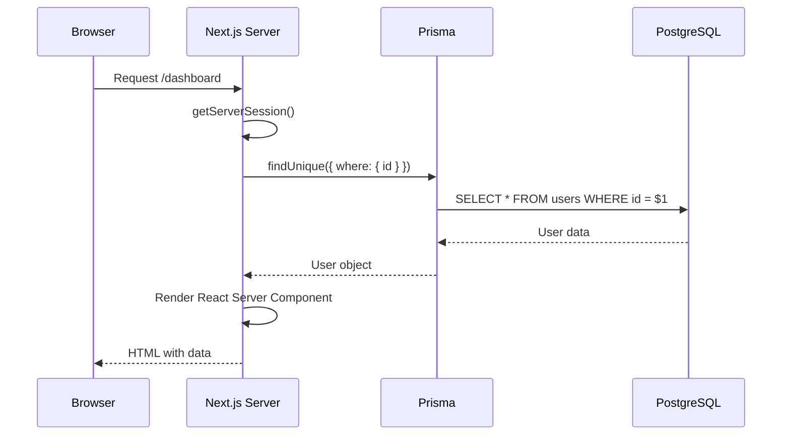
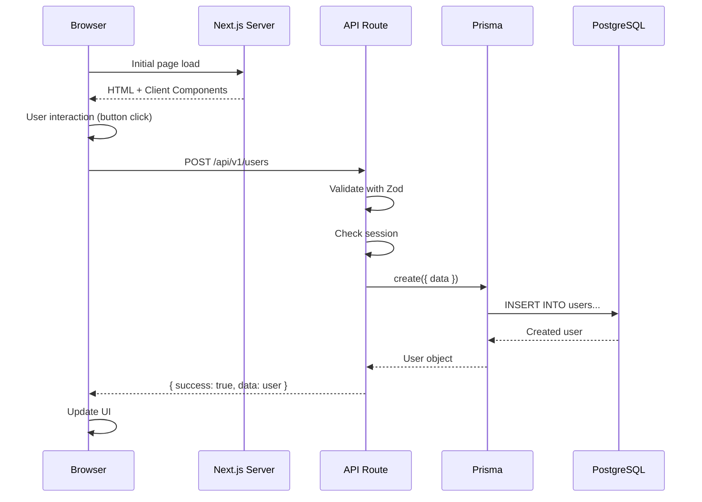
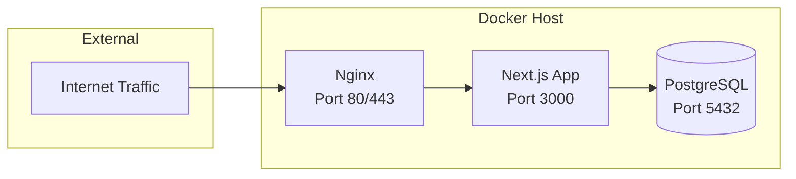

# Architecture Overview

## System Architecture

Sunrise implements a **monolithic architecture** using Next.js 16+ with the App Router pattern. The system separates concerns through route groups, server/client component boundaries, and a versioned API layer for external access.

### High-Level Architecture



## Component Boundaries

### Route Groups (Pages)

Route groups organize pages without affecting URL structure. Each group has its own layout and shared logic:

**`app/(auth)/`** - Authentication flows

- Login, signup, password reset, email verification
- Unauthenticated users only (redirect if logged in)
- Minimal layout, centered forms
- Form validation with Zod

**`app/(protected)/`** - All protected routes

- Contains: `dashboard/`, `settings/`, `profile/` as subdirectories
- No `page.tsx` at group root (subdirectories provide pages)
- Requires authentication (protected by proxy)
- Shared application layout with navigation
- Server-side session checks
- **Extend**: Add new protected features as subdirectories (e.g., `analytics/`, `reports/`)

**`app/admin/`** - Admin dashboard (separate route group)

- Contains: overview, users management, logs viewer, feature flags
- **Not a route group** - uses `/admin` URL prefix directly
- Requires ADMIN role (enforced via `requireAdmin()` utility)
- Custom sidebar layout distinct from protected routes
- Pages:
  - `/admin` - Dashboard overview with system statistics
  - `/admin/users` - User list with search, pagination, role badges
  - `/admin/users/[id]` - Individual user detail and edit
  - `/admin/users/invite` - User invitation form
  - `/admin/logs` - Application log viewer with filtering
  - `/admin/features` - Feature flag management (create, toggle, edit, delete)
- Server-side role checks on each page via `requireAdmin()`
- Separate from `(protected)` to allow distinct layout and stricter access control

**`app/(public)/`** - All public pages

- Landing page (`page.tsx`), about, contact, pricing, etc.
- No authentication required
- SEO-optimized
- Shared marketing layout with header/footer
- **Extend**: Add new public pages as subdirectories (e.g., `blog/`, `docs/`)

**Creating New Route Groups:**
When you need a different layout or authentication model:

- Admin panel with distinct UI: `app/(admin)/layout.tsx`
- Documentation site: `app/(docs)/layout.tsx`
- Customer portal: `app/(portal)/layout.tsx`

### Server vs. Client Components

**Server Components** (default):

```typescript
// app/(dashboard)/dashboard/page.tsx
// Server component - runs on server, no 'use client' directive
import { getServerSession } from '@/lib/auth/utils';
import { prisma } from '@/lib/db/client';

export default async function DashboardPage() {
  const session = await getServerSession();
  const user = await prisma.user.findUnique({
    where: { id: session.user.id }
  });

  return <DashboardContent user={user} />;
}
```

**Benefits**: Direct database access, reduced client JS, better SEO, automatic code splitting

**Client Components**:

```typescript
// components/forms/login-form.tsx
'use client'

import { useForm } from 'react-hook-form';
import { zodResolver } from '@hookform/resolvers/zod';
import { authClient } from '@/lib/auth/client';
import { loginSchema } from '@/lib/validations/auth';

export function LoginForm() {
  const form = useForm<LoginFormValues>({
    resolver: zodResolver(loginSchema)
  });

  // Interactive form with hooks
  return <form onSubmit={form.handleSubmit(onSubmit)}>...</form>;
}
```

**Use When**: Forms, event handlers, browser APIs, React hooks, real-time features

### API Layer Design

API routes (`app/api/`) provide RESTful endpoints for external clients and client-side operations:

```typescript
// app/api/v1/users/route.ts
import { NextRequest } from 'next/server';
import { getServerSession } from '@/lib/auth/utils';
import { prisma } from '@/lib/db/client';

export async function GET(request: NextRequest) {
  const session = await getServerSession();

  if (!session) {
    return Response.json({ success: false, error: { message: 'Unauthorized' } }, { status: 401 });
  }

  const users = await prisma.user.findMany();

  return Response.json({
    success: true,
    data: users,
    meta: { count: users.length },
  });
}
```

**Versioning**: All public APIs use `/api/v1/` prefix for future compatibility
**Authentication**: Session-based using better-auth
**Responses**: Standardized `{ success, data, error }` format

## Data Flow Patterns

### Server Component Data Flow



**Performance**: Single round-trip, no waterfall requests, automatic caching

### Client-Side API Flow



**Use Cases**: Mutations from client, external API access, client-side data fetching

## Deployment Architecture

### Production Stack (Docker)



**Container Details**:

- **Nginx**: Reverse proxy, SSL termination, static asset serving
- **Next.js**: Standalone build (~100MB image), Node.js 20 Alpine, non-root user
- **PostgreSQL**: Persistent volume, automated backups, connection pooling

### Scaling Strategy

**Current**: Single server, vertical scaling (increase CPU/RAM)
**Reasoning**: Monolithic architecture optimized for small-to-medium load

**Future Horizontal Scaling** (if needed):

1. Extract API routes to separate service
2. Add load balancer (multiple Next.js instances)
3. Implement session store (Redis) for stateless instances
4. Add database read replicas
5. CDN for static assets

**Decision Rationale**: Start simple, scale when needed. Premature distribution adds complexity without benefits at current scale.

## Performance Considerations

### Built-in Optimizations

- **Automatic Code Splitting**: Each route only loads required JavaScript
- **Image Optimization**: Next.js Image component with WebP conversion
- **Font Optimization**: Automatic font subsetting and preloading
- **Static Generation**: Pre-render marketing pages at build time
- **Streaming**: Progressive page rendering with React Suspense

### Caching Strategy

```typescript
// Server component with caching
export const revalidate = 3600; // Revalidate every hour

export default async function ProductsPage() {
  const products = await prisma.product.findMany();
  return <ProductList products={products} />;
}
```

**ISR (Incremental Static Regeneration)**: Pre-rendered pages with periodic updates
**On-Demand Revalidation**: Cache invalidation via API calls when data changes

### Database Query Optimization

- Connection pooling (Prisma default: 10 connections)
- Index strategy on frequently queried fields
- Select only needed fields (`select: { id: true, name: true }`)
- Eager loading with `include` to prevent N+1 queries

## Security Architecture

Security is implemented as defense-in-depth across multiple layers. See [Security Overview](../security/overview.md) for details on:

- Security headers (CSP, HSTS, X-Frame-Options)
- Rate limiting and CORS
- Input sanitization
- Proxy-based route protection

For authentication security (sessions, passwords, OAuth), see [Auth Security](../auth/security.md).

## Related Documentation

- [Dependencies](./dependencies.md) - Dependency injection and package management
- [Patterns](./patterns.md) - Code organization and error handling patterns
- [Auth Integration](../auth/integration.md) - better-auth integration details
- [API Endpoints](../api/endpoints.md) - API route documentation
