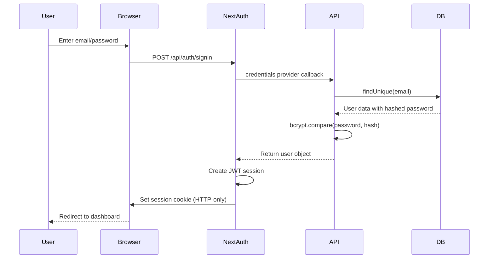
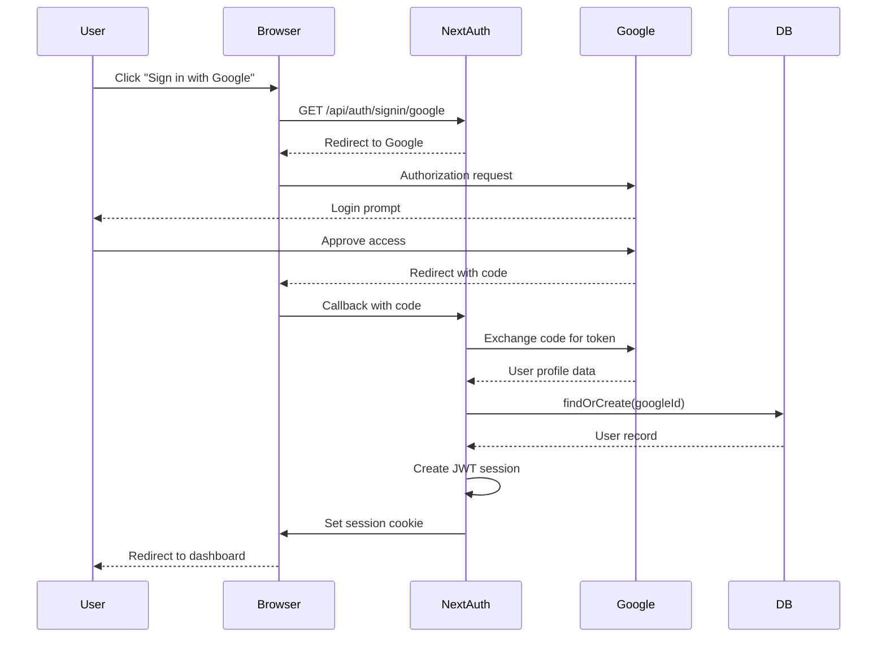
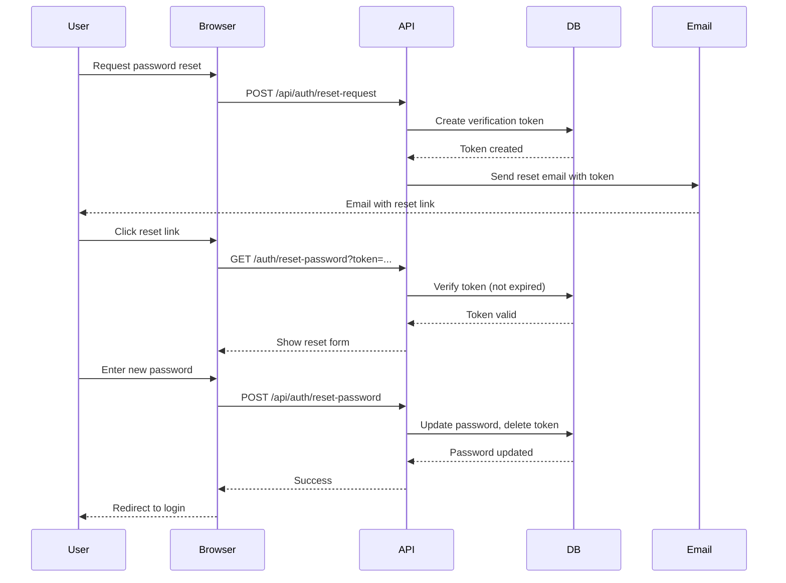

# Authentication Overview

## Authentication System

Sunrise uses **NextAuth.js v5** (also known as Auth.js) for authentication, providing a flexible framework that supports multiple authentication strategies: credentials (email/password), OAuth providers (Google, GitHub, etc.), and magic links.

The system implements JWT-based sessions stored in HTTP-only cookies, with user data persisted in PostgreSQL via Prisma. This approach balances security, performance, and developer experience.

## Authentication Flow

### Credentials Flow (Email/Password)



### OAuth Flow (Google)



## Core Configuration

### NextAuth Configuration

```typescript
// lib/auth/config.ts
import { NextAuthOptions } from 'next-auth';
import { PrismaAdapter } from '@auth/prisma-adapter';
import CredentialsProvider from 'next-auth/providers/credentials';
import GoogleProvider from 'next-auth/providers/google';
import { prisma } from '@/lib/db/client';
import { verifyPassword } from '@/lib/auth/passwords';

export const authOptions: NextAuthOptions = {
  adapter: PrismaAdapter(prisma),
  session: {
    strategy: 'jwt',
    maxAge: 30 * 24 * 60 * 60, // 30 days
  },
  pages: {
    signIn: '/login',
    signOut: '/logout',
    error: '/auth/error',
    verifyRequest: '/auth/verify-request',
  },
  providers: [
    CredentialsProvider({
      name: 'Credentials',
      credentials: {
        email: { label: "Email", type: "email" },
        password: { label: "Password", type: "password" }
      },
      async authorize(credentials) {
        if (!credentials?.email || !credentials?.password) {
          throw new Error('Email and password required');
        }

        const user = await prisma.user.findUnique({
          where: { email: credentials.email },
        });

        if (!user || !user.password) {
          throw new Error('Invalid credentials');
        }

        const isValid = await verifyPassword(
          credentials.password,
          user.password
        );

        if (!isValid) {
          throw new Error('Invalid credentials');
        }

        return {
          id: user.id,
          email: user.email,
          name: user.name,
          role: user.role,
        };
      },
    }),
    GoogleProvider({
      clientId: process.env.GOOGLE_CLIENT_ID!,
      clientSecret: process.env.GOOGLE_CLIENT_SECRET!,
    }),
  ],
  callbacks: {
    async jwt({ token, user, account }) {
      // Initial sign in
      if (user) {
        token.id = user.id;
        token.role = user.role;
      }

      // OAuth sign in
      if (account?.provider === 'google') {
        token.provider = 'google';
      }

      return token;
    },
    async session({ session, token }) {
      if (session.user) {
        session.user.id = token.id as string;
        session.user.role = token.role as string;
      }
      return session;
    },
  },
  events: {
    async signIn({ user, account, isNewUser }) {
      // Track sign-ins, send welcome email to new users, etc.
      if (isNewUser) {
        await sendWelcomeEmail(user.email, user.name);
      }

      await prisma.user.update({
        where: { id: user.id },
        data: { lastLoginAt: new Date() },
      });
    },
  },
};
```

### NextAuth Route Handler

```typescript
// app/api/auth/[...nextauth]/route.ts
import NextAuth from 'next-auth';
import { authOptions } from '@/lib/auth/config';

const handler = NextAuth(authOptions);

export { handler as GET, handler as POST };
```

## Session Management

### Server-Side Session Access

```typescript
// In Server Components
import { getServerSession } from 'next-auth';
import { authOptions } from '@/lib/auth/config';

export default async function DashboardPage() {
  const session = await getServerSession(authOptions);

  if (!session) {
    redirect('/login');
  }

  return <Dashboard user={session.user} />;
}
```

```typescript
// In API Routes
import { getServerSession } from 'next-auth';
import { authOptions } from '@/lib/auth/config';

export async function GET(request: NextRequest) {
  const session = await getServerSession(authOptions);

  if (!session) {
    return Response.json(
      { error: 'Unauthorized' },
      { status: 401 }
    );
  }

  // Access session.user.id, session.user.email, etc.
  const data = await fetchUserData(session.user.id);
  return Response.json({ data });
}
```

### Client-Side Session Access

```typescript
// In Client Components
'use client'

import { useSession } from 'next-auth/react';

export function UserProfile() {
  const { data: session, status } = useSession();

  if (status === 'loading') {
    return <Skeleton />;
  }

  if (status === 'unauthenticated') {
    return <LoginPrompt />;
  }

  return <div>Welcome, {session.user.name}</div>;
}
```

### Session Provider Setup

```typescript
// app/providers/session-provider.tsx
'use client'

import { SessionProvider as NextAuthSessionProvider } from 'next-auth/react';

export function SessionProvider({ children }: { children: React.ReactNode }) {
  return <NextAuthSessionProvider>{children}</NextAuthSessionProvider>;
}
```

```typescript
// app/layout.tsx
import { SessionProvider } from '@/app/providers/session-provider';

export default function RootLayout({ children }) {
  return (
    <html>
      <body>
        <SessionProvider>{children}</SessionProvider>
      </body>
    </html>
  );
}
```

## Password Management

### Password Hashing

```typescript
// lib/auth/passwords.ts
import bcrypt from 'bcrypt';

const SALT_ROUNDS = 12;

export async function hashPassword(password: string): Promise<string> {
  return bcrypt.hash(password, SALT_ROUNDS);
}

export async function verifyPassword(
  password: string,
  hashedPassword: string
): Promise<boolean> {
  return bcrypt.compare(password, hashedPassword);
}
```

### Password Validation

```typescript
// lib/validations/password.ts
import { z } from 'zod';

export const passwordSchema = z
  .string()
  .min(8, 'Password must be at least 8 characters')
  .max(100, 'Password must be less than 100 characters')
  .regex(/[A-Z]/, 'Password must contain at least one uppercase letter')
  .regex(/[a-z]/, 'Password must contain at least one lowercase letter')
  .regex(/[0-9]/, 'Password must contain at least one number')
  .regex(/[^A-Za-z0-9]/, 'Password must contain at least one special character');

export const changePasswordSchema = z
  .object({
    currentPassword: z.string(),
    newPassword: passwordSchema,
    confirmPassword: z.string(),
  })
  .refine((data) => data.newPassword === data.confirmPassword, {
    message: "Passwords don't match",
    path: ['confirmPassword'],
  });
```

## Password Reset Flow



### Password Reset Implementation

```typescript
// app/api/auth/reset-request/route.ts
import { prisma } from '@/lib/db/client';
import { randomBytes } from 'crypto';
import { sendPasswordResetEmail } from '@/lib/email/templates';

export async function POST(request: Request) {
  const { email } = await request.json();

  const user = await prisma.user.findUnique({
    where: { email },
  });

  // Always return success to prevent email enumeration
  if (!user) {
    return Response.json({ success: true });
  }

  // Create reset token
  const token = randomBytes(32).toString('hex');
  const expires = new Date(Date.now() + 1000 * 60 * 60); // 1 hour

  await prisma.verificationToken.create({
    data: {
      identifier: email,
      token,
      expires,
    },
  });

  // Send email
  await sendPasswordResetEmail(email, token);

  return Response.json({ success: true });
}
```

## Email Verification

### Verification Flow

```typescript
// app/api/auth/verify-email/route.ts
import { prisma } from '@/lib/db/client';

export async function GET(request: NextRequest) {
  const token = request.nextUrl.searchParams.get('token');

  if (!token) {
    return Response.json({ error: 'Token required' }, { status: 400 });
  }

  const verificationToken = await prisma.verificationToken.findUnique({
    where: { token },
  });

  if (!verificationToken || verificationToken.expires < new Date()) {
    return Response.json({ error: 'Invalid or expired token' }, { status: 400 });
  }

  await prisma.user.update({
    where: { email: verificationToken.identifier },
    data: { emailVerified: new Date() },
  });

  await prisma.verificationToken.delete({
    where: { token },
  });

  return Response.json({ success: true });
}
```

## Decision History & Trade-offs

### JWT vs. Database Sessions
**Decision**: JWT sessions (default NextAuth.js v5 strategy)
**Rationale**:
- Stateless (no database lookup on every request)
- Scales horizontally (no shared session store needed)
- Works with edge runtime
- Simpler deployment (no Redis dependency)

**Trade-offs**:
- Can't invalidate sessions server-side (until expiry)
- Larger cookie size (~1-2KB vs. session ID)
- Token refresh needed for long-lived sessions

**Mitigation**: Short session lifetime (30 days), implement token refresh for critical changes

### bcrypt vs. argon2
**Decision**: bcrypt for password hashing
**Rationale**:
- Industry standard, well-tested
- Widely supported across platforms
- Good performance with 12 rounds
- Lower memory requirements than argon2

**Trade-offs**: argon2 is technically more resistant to GPU/ASIC attacks

### NextAuth.js v5 vs. Custom Auth
**Decision**: NextAuth.js over building custom authentication
**Rationale**:
- Saves weeks of development time
- Security best practices built-in
- OAuth provider integrations ready
- Active maintenance and community
- Built specifically for Next.js App Router

**Trade-offs**:
- Abstraction layer (less control)
- Must follow NextAuth patterns
- Beta version (v5) has fewer examples

**Mitigation**: Comprehensive documentation, tested patterns, pin exact version

## Performance Considerations

### Session Caching
NextAuth.js automatically caches sessions in server components. Manual revalidation if user data changes:

```typescript
import { revalidatePath } from 'next/cache';

// After updating user profile
await prisma.user.update({ where: { id }, data });
revalidatePath('/dashboard');
```

### Database Connection Pooling
Prisma handles connection pooling (default: 10 connections). For high-traffic auth endpoints, consider increasing:

```prisma
datasource db {
  provider = "postgresql"
  url      = env("DATABASE_URL")
  // Add: ?connection_limit=20
}
```

## Related Documentation

- [Auth Integration](./integration.md) - Framework integration patterns
- [Auth Security](./security.md) - Security model and threat mitigation
- [API Headers](../api/headers.md) - Authentication headers and middleware
- [Database Models](../database/models.md) - User and session schema
