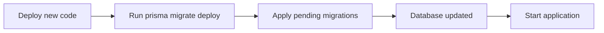

# Database Migrations

## Migration Strategy

Sunrise uses **Prisma Migrate** for database schema evolution. Migrations are version-controlled SQL files that track all schema changes, ensuring consistent database state across environments.

## Migration Workflow

### Development Workflow


### Production Workflow



## Migration Commands

### Development Commands

```bash
# Create migration from schema changes
npx prisma migrate dev --name add_user_role

# Creates:
# - prisma/migrations/20250112000000_add_user_role/migration.sql
# - Applies migration to database
# - Generates Prisma Client

# Reset database (WARNING: deletes all data)
npx prisma migrate reset

# Apply pending migrations without creating new ones
npx prisma migrate dev

# Generate Prisma Client only (no migrations)
npx prisma generate
```

### Production Commands

```bash
# Deploy migrations to production
npx prisma migrate deploy

# Check migration status
npx prisma migrate status

# Resolve failed migrations
npx prisma migrate resolve --rolled-back 20250112000000_migration_name
npx prisma migrate resolve --applied 20250112000000_migration_name
```

### Database Commands

```bash
# Push schema changes without creating migration (prototyping)
npx prisma db push

# Pull schema from existing database
npx prisma db pull

# Seed database with initial data
npx prisma db seed
```

## Migration File Structure

```
prisma/
├── schema.prisma
├── migrations/
│   ├── migration_lock.toml
│   ├── 20250101120000_init/
│   │   └── migration.sql
│   ├── 20250105150000_add_user_role/
│   │   └── migration.sql
│   └── 20250110180000_add_posts_table/
│       └── migration.sql
└── seed.ts
```

### Migration File Example

```sql
-- prisma/migrations/20250105150000_add_user_role/migration.sql

-- CreateEnum
CREATE TYPE "Role" AS ENUM ('USER', 'ADMIN');

-- AlterTable
ALTER TABLE "users" ADD COLUMN "role" "Role" NOT NULL DEFAULT 'USER';

-- CreateIndex
CREATE INDEX "users_role_idx" ON "users"("role");
```

## Creating Migrations

### 1. Modify Schema

```prisma
// prisma/schema.prisma

model User {
  id       String   @id @default(cuid())
  email    String   @unique
  name     String?
  role     Role     @default(USER)  // New field
  // ... other fields
}

enum Role {  // New enum
  USER
  ADMIN
}
```

### 2. Generate Migration

```bash
npx prisma migrate dev --name add_user_role
```

**Output**:

```
Prisma schema loaded from prisma/schema.prisma
Datasource "db": PostgreSQL database "sunrise", schema "public" at "localhost:5432"

The following migration(s) have been created and applied from new schema changes:

migrations/
  └─ 20250105150000_add_user_role/
    └─ migration.sql

Your database is now in sync with your schema.

✔ Generated Prisma Client
```

### 3. Review Migration SQL

```sql
-- Always review generated SQL before committing!

-- CreateEnum (check enum values)
CREATE TYPE "Role" AS ENUM ('USER', 'ADMIN');

-- AlterTable (check DEFAULT and NOT NULL constraints)
ALTER TABLE "users" ADD COLUMN "role" "Role" NOT NULL DEFAULT 'USER';
```

### 4. Test Migration

```bash
# Test in development
npm run dev

# Test rollback
npx prisma migrate reset
npx prisma migrate dev
```

### 5. Commit Migration

```bash
git add prisma/migrations/20250105150000_add_user_role/
git commit -m "feat: add user role enum to database"
```

## Common Migration Patterns

### Adding Optional Field

```prisma
// Safe: No migration issues
model User {
  bio String?  // Nullable field
}
```

```sql
-- Generated migration
ALTER TABLE "users" ADD COLUMN "bio" TEXT;
```

### Adding Required Field

```prisma
// Requires default value or data migration
model User {
  bio String @default("")  // Default for existing rows
}
```

```sql
-- Generated migration
ALTER TABLE "users" ADD COLUMN "bio" TEXT NOT NULL DEFAULT '';
```

### Adding Field with Complex Default

```prisma
model User {
  status String @default("active")
}
```

```bash
# 1. Create migration with optional field first
npx prisma migrate dev --name add_user_status_optional

# 2. Manually update existing rows
npx prisma studio
# or create data migration script

# 3. Make field required in second migration
npx prisma migrate dev --name make_user_status_required
```

### Renaming Fields

```prisma
// Prisma sees this as: drop old_name, add new_name
// Data will be lost!

model User {
  fullName String  // Renamed from 'name'
}
```

**Manual Rename**:

```bash
# 1. Create empty migration
npx prisma migrate dev --name rename_user_name --create-only

# 2. Edit migration SQL manually
```

```sql
-- prisma/migrations/20250105150000_rename_user_name/migration.sql
ALTER TABLE "users" RENAME COLUMN "name" TO "full_name";
```

```bash
# 3. Apply migration
npx prisma migrate dev
```

### Dropping Tables/Columns

```prisma
// Remove model from schema
// Prisma generates DROP TABLE
```

**Caution**: Irreversible data loss!

```bash
# Safer: Create migration without applying
npx prisma migrate dev --name drop_old_table --create-only

# Review SQL
cat prisma/migrations/*/migration.sql

# Backup data first
pg_dump sunrise > backup.sql

# Then apply
npx prisma migrate dev
```

## Data Migrations

### Seed File

```typescript
// prisma/seed.ts
import { PrismaClient } from '@prisma/client';
import { hashPassword } from '../lib/auth/passwords';

const prisma = new PrismaClient();

async function main() {
  console.log('Seeding database...');

  // Create admin user
  const adminPassword = await hashPassword('admin123');

  const admin = await prisma.user.upsert({
    where: { email: 'admin@example.com' },
    update: {},
    create: {
      email: 'admin@example.com',
      name: 'Admin User',
      password: adminPassword,
      role: 'ADMIN',
      emailVerified: new Date(),
    },
  });

  console.log('Created admin user:', admin.email);

  // Create test users
  for (let i = 1; i <= 10; i++) {
    const userPassword = await hashPassword('password123');

    await prisma.user.upsert({
      where: { email: `user${i}@example.com` },
      update: {},
      create: {
        email: `user${i}@example.com`,
        name: `Test User ${i}`,
        password: userPassword,
        role: 'USER',
      },
    });
  }

  console.log('Created 10 test users');
}

main()
  .catch((e) => {
    console.error(e);
    process.exit(1);
  })
  .finally(async () => {
    await prisma.$disconnect();
  });
```

**Run Seed**:

```bash
npx prisma db seed
```

**Configure in package.json**:

```json
{
  "prisma": {
    "seed": "ts-node --compiler-options {\"module\":\"CommonJS\"} prisma/seed.ts"
  }
}
```

### Custom Data Migrations

```typescript
// scripts/migrations/backfill-user-roles.ts
import { PrismaClient } from '@prisma/client';

const prisma = new PrismaClient();

async function backfillUserRoles() {
  // Find users without roles
  const users = await prisma.user.findMany({
    where: { role: null },
  });

  console.log(`Found ${users.length} users without roles`);

  // Update in batches
  for (const user of users) {
    const role = user.email.endsWith('@admin.com') ? 'ADMIN' : 'USER';

    await prisma.user.update({
      where: { id: user.id },
      data: { role },
    });
  }

  console.log('Backfill complete');
}

backfillUserRoles()
  .catch(console.error)
  .finally(() => prisma.$disconnect());
```

```bash
# Run manually
ts-node scripts/migrations/backfill-user-roles.ts
```

## Production Migration Strategy

### Pre-Deployment Checklist

```bash
# 1. Check migration status
npx prisma migrate status

# 2. Review pending migrations
ls -la prisma/migrations/

# 3. Backup database
pg_dump $DATABASE_URL > backup_$(date +%Y%m%d_%H%M%S).sql

# 4. Test migrations on staging
npx prisma migrate deploy

# 5. If successful, deploy to production
```

### Zero-Downtime Migrations

For large tables, some migrations may lock tables and cause downtime.

**Safe Patterns**:

1. **Add Optional Column** (no lock):

```sql
ALTER TABLE users ADD COLUMN bio TEXT;
```

2. **Add Index Concurrently** (no lock):

```sql
CREATE INDEX CONCURRENTLY "users_role_idx" ON "users"("role");
```

3. **Multi-Step for Required Columns**:

```bash
# Step 1: Add optional column
ALTER TABLE users ADD COLUMN status TEXT;

# Deploy code that writes to new column

# Step 2: Backfill existing rows
UPDATE users SET status = 'active' WHERE status IS NULL;

# Step 3: Make column required
ALTER TABLE users ALTER COLUMN status SET NOT NULL;
```

### Rollback Strategy

```bash
# Check failed migration
npx prisma migrate status

# Mark migration as rolled back
npx prisma migrate resolve --rolled-back 20250105150000_migration_name

# Manually revert database changes
psql $DATABASE_URL -c "DROP TABLE IF EXISTS new_table;"

# Fix schema and create new migration
npx prisma migrate dev --name fix_previous_migration
```

## Migration Best Practices

### 1. Always Review Generated SQL

```bash
# Create migration without applying
npx prisma migrate dev --name my_migration --create-only

# Review SQL
cat prisma/migrations/20250105150000_my_migration/migration.sql

# Apply after review
npx prisma migrate dev
```

### 2. Test Migrations Locally

```bash
# Reset and reapply all migrations
npx prisma migrate reset

# Verify application still works
npm run dev
```

### 3. Backup Before Production Migrations

```bash
# PostgreSQL backup
pg_dump $DATABASE_URL > backup.sql

# Restore if needed
psql $DATABASE_URL < backup.sql
```

### 4. Use Descriptive Migration Names

```bash
# Good
npx prisma migrate dev --name add_user_role_enum
npx prisma migrate dev --name create_posts_table

# Bad
npx prisma migrate dev --name migration
npx prisma migrate dev --name update
```

### 5. Never Edit Applied Migrations

Once a migration is applied and committed:

- **DO NOT** edit the migration SQL
- **DO NOT** delete migration files
- **DO** create a new migration to fix issues

### 6. Keep Migrations Small

```bash
# Bad: One huge migration
npx prisma migrate dev --name big_refactor

# Good: Multiple focused migrations
npx prisma migrate dev --name add_user_profile_fields
npx prisma migrate dev --name add_posts_table
npx prisma migrate dev --name add_user_post_relation
```

## Troubleshooting

### Migration Failed Midway

```bash
# Check status
npx prisma migrate status

# Mark as rolled back
npx prisma migrate resolve --rolled-back 20250105150000_migration

# Fix database manually if needed
psql $DATABASE_URL

# Create corrected migration
npx prisma migrate dev --name fix_migration
```

### Database Out of Sync

```bash
# Pull current database schema
npx prisma db pull

# This updates schema.prisma to match database
# Then create migration to formalize the changes
npx prisma migrate dev --name sync_with_database
```

### Prisma Client Out of Date

```bash
# Regenerate Prisma Client
npx prisma generate

# Or install fresh
npm install @prisma/client
npx prisma generate
```

## Decision History & Trade-offs

### Prisma Migrate vs. Manual Migrations

**Decision**: Prisma Migrate (official tooling)
**Rationale**:

- Integrated with Prisma schema
- Type-safe migrations
- Migration history tracking
- Automatic rollback detection

**Trade-offs**: Less control than raw SQL, learning curve for complex scenarios

### db push vs. migrate dev

**Decision**: Use `migrate dev` for tracked changes, `db push` for prototyping only
**Rationale**:

- `migrate dev`: Creates versioned migrations (production-ready)
- `db push`: Quick iteration without migration files (prototype only)

**Trade-offs**: `db push` can be faster during early development but loses history

### Seed Data Strategy

**Decision**: Seed file for initial admin user, minimal test data
**Rationale**:

- Admin user needed for first login
- Test data useful for development
- Production uses real data, not seeds

**Trade-offs**: Must maintain seed script as schema evolves

## Related Documentation

- [Database Schema](./schema.md) - Prisma schema design
- [Database Models](./models.md) - Using Prisma models
- [Guidelines](../guidelines.md) - Development workflow
- [Architecture Patterns](../architecture/patterns.md) - Error handling
