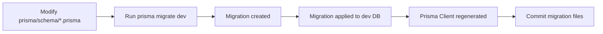
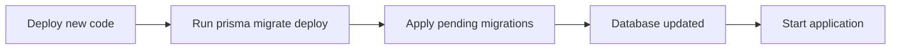

# Database Migrations

## Migration Strategy

Sunrise uses **Prisma Migrate** for database schema evolution. Migrations are version-controlled SQL files that track all schema changes, ensuring consistent database state across environments.

> **Two related docs you may want next:**
>
> - [`prisma-unmodelled-objects.md`](./prisma-unmodelled-objects.md) — the canonical inventory of raw-SQL objects (GIN/HNSW indexes, partial uniques, CHECK constraints, GENERATED columns) the baseline maintains and that `prisma migrate dev` will silently DROP unless inspected.
> - [`prisma-7-baseline-bugs.md`](./prisma-7-baseline-bugs.md) — the five reproducible Prisma 7 generator bugs the baseline hand-folds, with workarounds and notes for filing upstream.
>
> The drift-check script `npm run db:drift-check` probes every unmodelled object — run it after any `migrate deploy` against production.

## Migration Workflow

### Development Workflow


```mermaid
graph LR
    A[Modify prisma/schema/*.prisma] --> B[Run prisma migrate dev]
    B --> C[Migration created]
    C --> D[Migration applied to dev DB]
    D --> E[Prisma Client regenerated]
    E --> F[Commit migration files]
```

### Production Workflow


```mermaid
graph LR
    A[Deploy new code] --> B[Run prisma migrate deploy]
    B --> C[Apply pending migrations]
    C --> D[Database updated]
    D --> E[Start application]
```

## Migration Commands

### Development Commands

| Command                  | Purpose                                                       |
| ------------------------ | ------------------------------------------------------------- |
| `npm run db:migrate:dev` | Create + apply a migration from schema changes (dev only)     |
| `npm run db:reset`       | Drop DB, re-migrate from scratch, re-run seeds                |
| `npm run db:seed`        | Apply new/changed seed units (see [seeding.md](./seeding.md)) |
| `npm run db:generate`    | Regenerate Prisma Client without touching migrations          |
| `npm run db:studio`      | Open Prisma Studio                                            |

```bash
# Most common flow: edit a file in prisma/schema/, then…
npm run db:migrate:dev -- --name add_user_role
# Creates prisma/migrations/<timestamp>_add_user_role/migration.sql,
# applies it, and regenerates the Prisma Client.
```

### Production Commands

| Command                     | Purpose                                                                              |
| --------------------------- | ------------------------------------------------------------------------------------ |
| `npm run db:migrate:deploy` | Apply all pending migrations (runs in CI, compose migrator, Vercel, Render, Railway) |
| `npm run db:migrate:status` | Report pending / applied migrations without making changes                           |

```bash
# Resolve a failed migration (rare — only needed if a deploy died partway)
npx prisma migrate resolve --rolled-back <migration_name>
npx prisma migrate resolve --applied <migration_name>
```

### Prohibited

`prisma db push` is not available as a script. It bypasses migration history and makes dev/prod schemas diverge silently. Always use `db:migrate:dev` so every schema change is a versioned, reviewable file.

## Migration File Structure

```
prisma/
├── schema/                  # multi-file schema — one .prisma per domain
│   ├── base.prisma          # datasource + generator
│   └── …                    # auth, orchestration-*, mcp, platform, app
├── migrations/
│   ├── migration_lock.toml
│   ├── 20250101120000_init/
│   │   └── migration.sql
│   ├── 20250105150000_add_user_role/
│   │   └── migration.sql
│   └── 20250110180000_add_posts_table/
│       └── migration.sql
└── seed.ts
```

### Migration File Example

```sql
-- prisma/migrations/20250105150000_add_user_role/migration.sql

-- CreateEnum
CREATE TYPE "Role" AS ENUM ('USER', 'ADMIN');

-- AlterTable
ALTER TABLE "users" ADD COLUMN "role" "Role" NOT NULL DEFAULT 'USER';

-- CreateIndex
CREATE INDEX "users_role_idx" ON "users"("role");
```

## Creating Migrations

### 1. Modify Schema

```prisma
// prisma/schema/auth.prisma (one domain file in the schema folder)

model User {
  id       String   @id @default(cuid())
  email    String   @unique
  name     String?
  role     Role     @default(USER)  // New field
  // ... other fields
}

enum Role {  // New enum
  USER
  ADMIN
}
```

### 2. Generate Migration

```bash
npx prisma migrate dev --name add_user_role
```

**Output**:

```
Prisma schema loaded from prisma/schema
Datasource "db": PostgreSQL database "sunrise", schema "public" at "localhost:5432"

The following migration(s) have been created and applied from new schema changes:

migrations/
  └─ 20250105150000_add_user_role/
    └─ migration.sql

Your database is now in sync with your schema.

✔ Generated Prisma Client
```

### 3. Review Migration SQL

```sql
-- Always review generated SQL before committing!

-- CreateEnum (check enum values)
CREATE TYPE "Role" AS ENUM ('USER', 'ADMIN');

-- AlterTable (check DEFAULT and NOT NULL constraints)
ALTER TABLE "users" ADD COLUMN "role" "Role" NOT NULL DEFAULT 'USER';
```

### 4. Test Migration

```bash
# Test in development
npm run dev

# Test rollback
npx prisma migrate reset
npx prisma migrate dev
```

### 5. Commit Migration

```bash
git add prisma/migrations/20250105150000_add_user_role/
git commit -m "feat: add user role enum to database"
```

## Staying in Sync with Upstream Sunrise (Forks)

If you build your app on a fork of Sunrise, your migrations and Sunrise's share
one history. This section is the reconciliation recipe for pulling a new Sunrise
release into your fork. (For the higher-level fork model, see
[`CUSTOMIZATION.md`](../../CUSTOMIZATION.md).)

### How the histories combine

App and Sunrise migrations both live in `prisma/migrations/` and are applied in
**timestamp order** (Prisma sorts by the folder name, which is
`<timestamp>_<label>`). When you merge an upstream release, new Sunrise
migration folders **interleave with yours by timestamp** — a Sunrise migration
authored before your latest one sorts _before_ it, even though you merged it
later.

This is normal and safe: Prisma tracks applied migrations by folder name in the
`_prisma_migrations` table, so it applies whatever is recorded as not-yet-applied
regardless of merge order.

### Name app migrations distinctly

Prefix your app's migrations so you can tell at a glance which are yours when
they interleave:

```bash
npm run db:migrate:dev -- --name app_add_orders
# → prisma/migrations/<timestamp>_app_add_orders/
```

The prefix is purely for human triage during a merge — Prisma ignores the label
and orders by timestamp. A consistent prefix (e.g. `app_`) makes
`git diff -- prisma/migrations/` instantly readable.

### Recipe: merging a Sunrise release

```bash
# 1. Merge the upstream release into your branch (resolve any conflicts).
#    Conflicts in prisma/migrations/ are rare — each migration is its own
#    folder. migration_lock.toml only records the DB provider; if it conflicts,
#    keep either side (they're identical for the same provider).

# 2. See what the merge brought in that your DB hasn't applied yet.
npm run db:migrate:status

# 3. Apply the newly-merged migrations.
npm run db:migrate:dev        # development
npm run db:migrate:deploy     # production / CI
```

### Baselining or recovering a migration

Use `prisma migrate resolve` when the recorded state and the actual database
disagree — e.g. an upstream migration's effect is already present in your DB, or
a deploy died partway:

```bash
# Mark a migration as already applied (baseline — no SQL is run)
npx prisma migrate resolve --applied <migration_name>

# Mark a failed migration as rolled back, then fix forward
npx prisma migrate resolve --rolled-back <migration_name>
```

### Reading a release's migration set

The migrations a release added are simply the new folders under
`prisma/migrations/`. Diff against your last-synced point:

```bash
git diff <last-sync-ref>..<release-ref> -- prisma/migrations/
```

### Never edit Sunrise's migration SQL

Editing an applied migration desyncs every environment that already ran it.
If you need to change the result of a Sunrise migration, add your own
**follow-up** migration (`app_*`) that alters the schema forward. See
[Never Edit Applied Migrations](#5-never-edit-applied-migrations).

## Common Migration Patterns

### Adding Optional Field

```prisma
// Safe: No migration issues
model User {
  bio String?  // Nullable field
}
```

```sql
-- Generated migration
ALTER TABLE "users" ADD COLUMN "bio" TEXT;
```

### Adding Required Field

```prisma
// Requires default value or data migration
model User {
  bio String @default("")  // Default for existing rows
}
```

```sql
-- Generated migration
ALTER TABLE "users" ADD COLUMN "bio" TEXT NOT NULL DEFAULT '';
```

### Adding Field with Complex Default

```prisma
model User {
  status String @default("active")
}
```

```bash
# 1. Create migration with optional field first
npx prisma migrate dev --name add_user_status_optional

# 2. Manually update existing rows
npx prisma studio
# or create data migration script

# 3. Make field required in second migration
npx prisma migrate dev --name make_user_status_required
```

### Renaming Fields

```prisma
// Prisma sees this as: drop old_name, add new_name
// Data will be lost!

model User {
  fullName String  // Renamed from 'name'
}
```

**Manual Rename**:

```bash
# 1. Create empty migration
npx prisma migrate dev --name rename_user_name --create-only

# 2. Edit migration SQL manually
```

```sql
-- prisma/migrations/20250105150000_rename_user_name/migration.sql
ALTER TABLE "users" RENAME COLUMN "name" TO "full_name";
```

```bash
# 3. Apply migration
npx prisma migrate dev
```

### Dropping Tables/Columns

```prisma
// Remove model from schema
// Prisma generates DROP TABLE
```

**Caution**: Irreversible data loss!

```bash
# Safer: Create migration without applying
npx prisma migrate dev --name drop_old_table --create-only

# Review SQL
cat prisma/migrations/*/migration.sql

# Backup data first
pg_dump sunrise > backup.sql

# Then apply
npx prisma migrate dev
```

## Data Migrations

### Seeds

Seed data is managed by the content-hash-based runner in `prisma/runner.ts` — each unit under `prisma/seeds/NNN-slug.ts` is idempotent, re-runs only when its source changes, and tracks state in the `SeedHistory` table. `prisma migrate reset` automatically re-seeds via the `migrations.seed` hook in `prisma.config.ts`.

See [seeding.md](./seeding.md) for the full authoring guide, operational flows, and embeddings opt-in path.

### Custom Data Migrations

```typescript
// scripts/migrations/backfill-user-roles.ts
import { PrismaClient } from '@prisma/client';

const prisma = new PrismaClient();

async function backfillUserRoles() {
  // Find users without roles
  const users = await prisma.user.findMany({
    where: { role: null },
  });

  console.log(`Found ${users.length} users without roles`);

  // Update in batches
  for (const user of users) {
    const role = user.email.endsWith('@admin.com') ? 'ADMIN' : 'USER';

    await prisma.user.update({
      where: { id: user.id },
      data: { role },
    });
  }

  console.log('Backfill complete');
}

backfillUserRoles()
  .catch(console.error)
  .finally(() => prisma.$disconnect());
```

```bash
# Run manually
ts-node scripts/migrations/backfill-user-roles.ts
```

## Production Migration Strategy

### Pre-Deployment Checklist

```bash
# 1. Check migration status
npx prisma migrate status

# 2. Review pending migrations
ls -la prisma/migrations/

# 3. Backup database
pg_dump $DATABASE_URL > backup_$(date +%Y%m%d_%H%M%S).sql

# 4. Test migrations on staging
npx prisma migrate deploy

# 5. If successful, deploy to production
```

### Zero-Downtime Migrations

For large tables, some migrations may lock tables and cause downtime.

**Safe Patterns**:

1. **Add Optional Column** (no lock):

```sql
ALTER TABLE users ADD COLUMN bio TEXT;
```

2. **Add Index Concurrently** (no lock):

```sql
CREATE INDEX CONCURRENTLY "users_role_idx" ON "users"("role");
```

3. **Multi-Step for Required Columns**:

```bash
# Step 1: Add optional column
ALTER TABLE users ADD COLUMN status TEXT;

# Deploy code that writes to new column

# Step 2: Backfill existing rows
UPDATE users SET status = 'active' WHERE status IS NULL;

# Step 3: Make column required
ALTER TABLE users ALTER COLUMN status SET NOT NULL;
```

### Rollback Strategy

```bash
# Check failed migration
npx prisma migrate status

# Mark migration as rolled back
npx prisma migrate resolve --rolled-back 20250105150000_migration_name

# Manually revert database changes
psql $DATABASE_URL -c "DROP TABLE IF EXISTS new_table;"

# Fix schema and create new migration
npx prisma migrate dev --name fix_previous_migration
```

## Migration Best Practices

### 1. Always Review Generated SQL

```bash
# Create migration without applying
npx prisma migrate dev --name my_migration --create-only

# Review SQL
cat prisma/migrations/20250105150000_my_migration/migration.sql

# Apply after review
npx prisma migrate dev
```

### 2. Test Migrations Locally

```bash
# Reset and reapply all migrations
npx prisma migrate reset

# Verify application still works
npm run dev
```

### 3. Backup Before Production Migrations

```bash
# PostgreSQL backup
pg_dump $DATABASE_URL > backup.sql

# Restore if needed
psql $DATABASE_URL < backup.sql
```

### 4. Use Descriptive Migration Names

```bash
# Good
npx prisma migrate dev --name add_user_role_enum
npx prisma migrate dev --name create_posts_table

# Bad
npx prisma migrate dev --name migration
npx prisma migrate dev --name update
```

### 5. Never Edit Applied Migrations

Once a migration is applied and committed:

- **DO NOT** edit the migration SQL
- **DO NOT** delete migration files
- **DO** create a new migration to fix issues

### 6. Keep Migrations Small

```bash
# Bad: One huge migration
npx prisma migrate dev --name big_refactor

# Good: Multiple focused migrations
npx prisma migrate dev --name add_user_profile_fields
npx prisma migrate dev --name add_posts_table
npx prisma migrate dev --name add_user_post_relation
```

## Troubleshooting

### Migration Failed Midway

```bash
# Check status
npx prisma migrate status

# Mark as rolled back
npx prisma migrate resolve --rolled-back 20250105150000_migration

# Fix database manually if needed
psql $DATABASE_URL

# Create corrected migration
npx prisma migrate dev --name fix_migration
```

### Database Out of Sync

```bash
# Pull current database schema
npx prisma db pull

# This updates the schema in prisma/schema/ to match the database
# Then create migration to formalize the changes
npx prisma migrate dev --name sync_with_database
```

### Prisma Client Out of Date

```bash
# Regenerate Prisma Client
npx prisma generate

# Or install fresh
npm install @prisma/client
npx prisma generate
```

## Decision History & Trade-offs

### Prisma Migrate vs. Manual Migrations

**Decision**: Prisma Migrate (official tooling)
**Rationale**:

- Integrated with Prisma schema
- Type-safe migrations
- Migration history tracking
- Automatic rollback detection

**Trade-offs**: Less control than raw SQL, learning curve for complex scenarios

### Why we removed `db push`

**Decision**: `prisma db push` is not exposed as a script and should not be used.
**Rationale**:

- Bypasses migration history — changes made via `db push` are invisible to `prisma migrate status` and never propagate to teammates or production.
- Two developers running `db push` in parallel silently diverge their schemas.
- The cost of `db:migrate:dev` is ~2 seconds and produces a reviewable SQL file.

**Trade-off**: Prototyping a single field is marginally slower. Accepted — the previous dev's untracked push cost more than every migration we've ever written.

### Seed Data Strategy

**Decision**: Content-hash-based seed units in `prisma/seeds/`, tracked by `SeedHistory`. See [seeding.md](./seeding.md).

## PostgreSQL Extensions

Some features require PostgreSQL extensions to be installed on the server before migrations can run. These are enabled via migrations using `CREATE EXTENSION IF NOT EXISTS`, but the extension must be available on the PostgreSQL instance itself.

### pgvector

**Required for:** AI Agent Orchestration Layer — used to store and query vector embeddings for knowledge bases, enabling semantic search and retrieval-augmented generation (RAG) workflows.

**Prisma declaration:** The schema enables the `postgresqlExtensions` preview feature and declares `extensions = [vector]` on the datasource, so Prisma is aware of the extension when diffing schemas.

**Schema additions** (originally landed as separate migrations between 2026-04-09 and 2026-04-10, all absorbed into `prisma/migrations/00000000000000_baseline/migration.sql` by the 2026-05-29 squash):

| Origin migration                                | What it added to the schema                                                                                                                                                                                                                       |
| ----------------------------------------------- | ------------------------------------------------------------------------------------------------------------------------------------------------------------------------------------------------------------------------------------------------- |
| `enable_pgvector` (2026-04-09)                  | Runs `CREATE EXTENSION IF NOT EXISTS vector;`                                                                                                                                                                                                     |
| `add_agent_orchestration_models` (2026-04-09)   | Creates the 13 `ai_*` tables. Includes the `embedding vector(1536)` column on `ai_knowledge_chunk`.                                                                                                                                               |
| `add_hnsw_vector_index` (2026-04-09)            | Creates `idx_knowledge_embedding` — an HNSW index on `ai_knowledge_chunk.embedding` using `vector_cosine_ops` (m=16, ef_construction=64) for approximate nearest-neighbour cosine search.                                                         |
| `dedupe_ready_knowledge_documents` (2026-04-10) | Creates `idx_knowledge_doc_file_hash_ready` — a partial unique index on `ai_knowledge_document("fileHash") WHERE status = 'ready'`, preventing concurrent duplicate uploads of the same content hash while still allowing retries after failures. |

**Server requirement:** pgvector must be installed on your PostgreSQL instance. It is not bundled with PostgreSQL by default.

| Environment                 | How to install                                                     |
| --------------------------- | ------------------------------------------------------------------ |
| Local (Homebrew)            | `brew install pgvector`                                            |
| Local (apt)                 | `apt install postgresql-<version>-pgvector`                        |
| Docker                      | Use `pgvector/pgvector:pg15` image instead of `postgres:15-alpine` |
| Render / Railway / Supabase | Available as a one-click extension in the dashboard                |
| AWS RDS / Aurora            | Enable via parameter groups or the RDS console                     |

**Verify it's available:**

```sql
SELECT * FROM pg_available_extensions WHERE name = 'vector';
```

If the migration fails with `extension "vector" is not available`, install pgvector on the server and re-run `npm run db:migrate:deploy`.

## Related Documentation

- [Database Schema](./schema.md) - Prisma schema design
- [Database Models](./models.md) - Using Prisma models
- [Guidelines](../guidelines.md) - Development workflow
- [Architecture Patterns](../architecture/patterns.md) - Error handling
