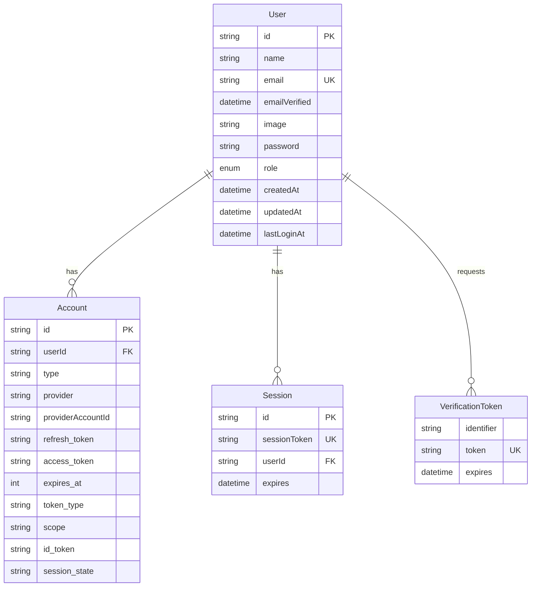

# Database Schema

## Database Design

Sunrise uses **PostgreSQL 15+** as the relational database with **Prisma ORM** for type-safe database access. The schema follows normalization principles while balancing query performance and development velocity.

## Entity Relationship Diagram



## Prisma Schema

```prisma
// prisma/schema.prisma

generator client {
  provider = "prisma-client-js"
}

datasource db {
  provider = "postgresql"
  url      = env("DATABASE_URL")
}

// ============================================
// User Management
// ============================================

enum Role {
  USER
  ADMIN
  MODERATOR
}

model User {
  id            String    @id @default(cuid())
  name          String?
  email         String    @unique
  emailVerified DateTime?
  image         String?
  password      String?   // Nullable for OAuth-only users
  role          Role      @default(USER)
  createdAt     DateTime  @default(now())
  updatedAt     DateTime  @updatedAt
  lastLoginAt   DateTime?

  // Relations
  accounts Account[]
  sessions Session[]

  @@index([email])
  @@index([role])
  @@map("users")
}

// ============================================
// NextAuth.js Required Models
// ============================================

model Account {
  id                String  @id @default(cuid())
  userId            String
  type              String
  provider          String
  providerAccountId String
  refresh_token     String? @db.Text
  access_token      String? @db.Text
  expires_at        Int?
  token_type        String?
  scope             String?
  id_token          String? @db.Text
  session_state     String?

  user User @relation(fields: [userId], references: [id], onDelete: Cascade)

  @@unique([provider, providerAccountId])
  @@index([userId])
  @@map("accounts")
}

model Session {
  id           String   @id @default(cuid())
  sessionToken String   @unique
  userId       String
  expires      DateTime
  user         User     @relation(fields: [userId], references: [id], onDelete: Cascade)

  @@index([userId])
  @@map("sessions")
}

model VerificationToken {
  identifier String
  token      String   @unique
  expires    DateTime

  @@unique([identifier, token])
  @@index([identifier])
  @@index([token])
  @@map("verification_tokens")
}

// ============================================
// Application Models (Examples)
// ============================================

// Add your application-specific models here
// Example:

// model Post {
//   id        String   @id @default(cuid())
//   title     String
//   content   String   @db.Text
//   published Boolean  @default(false)
//   authorId  String
//   createdAt DateTime @default(now())
//   updatedAt DateTime @updatedAt
//
//   author User @relation(fields: [authorId], references: [id], onDelete: Cascade)
//
//   @@index([authorId])
//   @@index([published])
//   @@map("posts")
// }
```

## Schema Design Decisions

### Primary Keys: CUID vs UUID

**Decision**: Use CUID (`@default(cuid())`)

**Rationale**:

- Collision-resistant (like UUID)
- Sortable by creation time (unlike UUID v4)
- Shorter than UUID (25 chars vs 36)
- URL-safe characters

**Example**: `cmjbv4i3x00003wsloputgwul`

**Format**: `c[a-z0-9]{24}` (25 characters total, starts with 'c')

#### better-auth ID Generation Configuration

**Important**: By default, better-auth generates its own IDs (32-character format) instead of using Prisma's `@default(cuid())`. To ensure **consistent CUID format across all user creation methods**, better-auth is configured to delegate ID generation to Prisma:

```typescript
// lib/auth/config.ts
export const auth = betterAuth({
  // ... other config
  advanced: {
    database: {
      generateId: () => false, // Delegate to Prisma's @default(cuid())
    },
  },
});
```

**This ensures**:

- ✅ UI signup via better-auth → CUID format
- ✅ OAuth signup via better-auth → CUID format
- ✅ API user creation (delegates to better-auth) → CUID format
- ✅ Direct Prisma calls (seed script) → CUID format

Without this configuration, better-auth would generate 32-character IDs, resulting in inconsistent ID formats across the application.

### Timestamps

All models include:

- `createdAt`: Automatic timestamp on creation
- `updatedAt`: Automatic timestamp on every update

```prisma
createdAt DateTime @default(now())
updatedAt DateTime @updatedAt
```

### Nullable vs. Required Fields

**Required Fields** (not null):

- `email`: Essential for user identification
- `role`: Every user must have a role (defaults to USER)
- `createdAt`, `updatedAt`: System-managed timestamps

**Nullable Fields** (`?`):

- `name`: Optional, some users may not provide
- `password`: OAuth users don't have passwords
- `emailVerified`: Null until verified
- `image`: Profile picture is optional
- `lastLoginAt`: Null for users who never logged in

### Cascading Deletes

```prisma
user User @relation(fields: [userId], references: [id], onDelete: Cascade)
```

**Strategy**: CASCADE for owned data

- Delete user → automatically delete accounts, sessions
- Prevents orphaned records
- Maintains referential integrity

**Alternative**: SET NULL for shared references

```prisma
// If posts should survive author deletion
author User @relation(fields: [authorId], references: [id], onDelete: SetNull)
```

## Indexes

### Purpose of Indexes

Indexes speed up queries but slow down writes. Index fields that are:

1. Used in WHERE clauses frequently
2. Used in ORDER BY clauses
3. Foreign keys
4. Unique constraints

### Index Strategy

```prisma
@@index([email])          // Fast user lookup by email
@@index([role])           // Fast filtering by role
@@index([userId])         // Fast joins and foreign key lookups
@@index([provider, providerAccountId])  // Compound index for OAuth
```

**Query Performance**:

- Without index: O(n) table scan
- With index: O(log n) B-tree search

### Unique Constraints

```prisma
email String @unique              // Single field unique
@@unique([provider, providerAccountId])  // Composite unique
```

**Purpose**:

- Enforce business rules (one email per user)
- Prevent duplicate OAuth connections
- Automatically creates index

## Table Naming Convention

```prisma
@@map("users")  // Table name in PostgreSQL
```

**Convention**: Plural snake_case

- Model: `User` (PascalCase)
- Table: `users` (plural snake_case)
- Consistency with SQL conventions

## Data Types

### String Types

```prisma
name   String         // VARCHAR(255) default
bio    String @db.Text  // TEXT for long content
```

- `String`: Default VARCHAR(255)
- `@db.Text`: Unlimited length (use for long content)

### DateTime

```prisma
createdAt DateTime @default(now())
expires   DateTime
```

- Stored as TIMESTAMP WITH TIME ZONE
- UTC recommended for consistency

### Enums

```prisma
enum Role {
  USER
  ADMIN
  MODERATOR
}

role Role @default(USER)
```

**Benefits**:

- Type safety
- Database-level constraint
- Clear documentation

**Alternative**: String with validation

```prisma
role String @default("user")  // Requires app-level validation
```

## Schema Evolution

### Adding New Fields

```prisma
// Safe: Add optional field
model User {
  // ... existing fields
  bio String?  // Nullable, no migration issues
}
```

```prisma
// Requires default or data migration
model User {
  // ... existing fields
  bio String @default("")  // Default value for existing rows
}
```

### Adding New Models

```prisma
// New model with relation to existing User
model Post {
  id        String   @id @default(cuid())
  title     String
  authorId  String
  createdAt DateTime @default(now())

  author User @relation(fields: [authorId], references: [id])

  @@index([authorId])
}

// Update User model to include relation
model User {
  // ... existing fields
  posts Post[]  // Add reverse relation
}
```

## Performance Considerations

### Connection Pooling

Prisma manages connection pooling automatically:

```prisma
datasource db {
  provider = "postgresql"
  url      = env("DATABASE_URL")
  // Default pool size: 10 connections
  // Adjust via connection string: ?connection_limit=20
}
```

**Recommended Settings**:

- Development: 5-10 connections
- Production: 10-20 connections (per instance)
- Formula: `pool_size = (core_count × 2) + effective_spindle_count`

### Query Optimization

```typescript
// Good: Select only needed fields
const user = await prisma.user.findUnique({
  where: { id },
  select: { id: true, name: true, email: true },
});

// Bad: Fetch entire row including password hash
const user = await prisma.user.findUnique({ where: { id } });

// Good: Eager loading with include (prevents N+1)
const users = await prisma.user.findMany({
  include: { posts: true },
});

// Bad: N+1 query problem
const users = await prisma.user.findMany();
for (const user of users) {
  const posts = await prisma.post.findMany({ where: { authorId: user.id } });
}
```

## Decision History & Trade-offs

### Prisma vs. TypeORM vs. Raw SQL

**Decision**: Prisma ORM
**Rationale**:

- Type-safe queries (generated types match schema exactly)
- Excellent developer experience (autocomplete, migrations)
- Prevents SQL injection by design
- Prisma Studio for database inspection

**Trade-offs**:

- Abstraction layer (slight performance overhead)
- Complex queries may require raw SQL
- Vendor-specific schema language

### PostgreSQL vs. MySQL

**Decision**: PostgreSQL
**Rationale**:

- Better JSON support (for future features)
- More powerful query capabilities (CTEs, window functions)
- Strong ACID compliance
- Better for complex applications

**Trade-offs**: Slightly higher resource usage than MySQL

### Soft Delete vs. Hard Delete

**Decision**: Hard delete (actual DELETE statements)
**Rationale**:

- GDPR compliance (right to erasure)
- Simpler queries (no WHERE deleted_at IS NULL everywhere)
- Smaller database size

**Trade-offs**: Can't recover deleted data

**Alternative Soft Delete Pattern**:

```prisma
model User {
  // ... fields
  deletedAt DateTime?

  @@index([deletedAt])
}

// Query only active users
const users = await prisma.user.findMany({
  where: { deletedAt: null },
});
```

## Security Considerations

### Never Select Passwords

```typescript
// ALWAYS exclude password field
const user = await prisma.user.findUnique({
  where: { email },
  select: {
    id: true,
    name: true,
    email: true,
    role: true,
    // password deliberately omitted
  },
});
```

### Parameterized Queries

Prisma automatically uses parameterized queries:

```typescript
// Safe: Prisma parameterizes automatically
const user = await prisma.user.findUnique({
  where: { email: userInput },
});

// Equivalent SQL:
// SELECT * FROM users WHERE email = $1

// If you must use raw SQL:
const users = await prisma.$queryRaw`
  SELECT * FROM users WHERE email = ${userInput}
`;
// Prisma still parameterizes even in raw queries
```

## Related Documentation

- [Database Models](./models.md) - Prisma model usage patterns
- [Database Migrations](./migrations.md) - Migration workflow
- [API Endpoints](../api/endpoints.md) - Using database in API routes
- [Architecture Dependencies](../architecture/dependencies.md) - Database client setup
