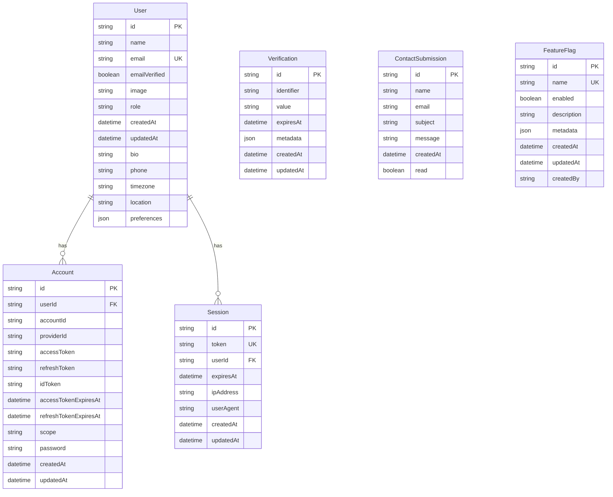

# Database Schema

## Database Design

Sunrise uses **PostgreSQL 15+** as the relational database with **Prisma ORM** for type-safe database access. The schema follows normalization principles while balancing query performance and development velocity.

## Entity Relationship Diagram



## Prisma Schema

```prisma
// prisma/schema.prisma

generator client {
  provider = "prisma-client-js"
}

datasource db {
  provider = "postgresql"
  url      = env("DATABASE_URL")
}

// ============================================
// User Management
// ============================================

enum Role {
  USER
  ADMIN
}

// Better Auth User model
//
// ID Generation: @default(cuid()) generates 25-character CUIDs
// better-auth is configured to delegate ID generation to Prisma
model User {
  id            String    @id @default(cuid())
  name          String
  email         String
  emailVerified Boolean   @default(false)
  image         String?
  createdAt     DateTime  @default(now())
  updatedAt     DateTime  @updatedAt

  // Custom fields for RBAC
  role          String    @default("USER")

  // Extended Profile Fields
  bio           String?   @db.Text        // User biography
  phone         String?   @db.VarChar(20) // Phone number
  timezone      String?   @default("UTC") // IANA timezone
  location      String?   @db.VarChar(100) // Free-form location
  preferences   Json?     @default("{}")  // Email/notification preferences

  // Relations
  sessions      Session[]
  accounts      Account[]

  @@unique([email])
  @@index([role])
  @@map("user")
}

// ============================================
// better-auth Required Models
// ============================================

// Better Auth Session model
model Session {
  id        String   @id @default(cuid())
  expiresAt DateTime
  token     String   @unique
  createdAt DateTime @default(now())
  updatedAt DateTime @updatedAt
  ipAddress String?
  userAgent String?
  userId    String

  user User @relation(fields: [userId], references: [id], onDelete: Cascade)

  @@index([userId])
  @@map("session")
}

// Better Auth Account model
model Account {
  id                    String    @id @default(cuid())
  accountId             String
  providerId            String
  userId                String
  accessToken           String?
  refreshToken          String?
  idToken               String?
  accessTokenExpiresAt  DateTime?
  refreshTokenExpiresAt DateTime?
  scope                 String?
  password              String?   // Hashed password for email/password auth
  createdAt             DateTime  @default(now())
  updatedAt             DateTime  @updatedAt

  user User @relation(fields: [userId], references: [id], onDelete: Cascade)

  @@index([userId])
  @@map("account")
}

// Better Auth Verification model
// Used for email verification, password reset, and invitation tokens
model Verification {
  id         String   @id @default(cuid())
  identifier String
  value      String
  expiresAt  DateTime
  createdAt  DateTime @default(now())
  updatedAt  DateTime @updatedAt
  metadata   Json?    // Stores invitation details (name, role, invitedBy)

  @@index([identifier])
  @@index([expiresAt])
  @@map("verification")
}

// ============================================
// Application Models
// ============================================

// Contact Form Submissions
model ContactSubmission {
  id        String   @id @default(cuid())
  name      String
  email     String
  subject   String
  message   String   @db.Text
  createdAt DateTime @default(now())
  read      Boolean  @default(false)

  @@index([read, createdAt])
  @@map("contact_submission")
}

// ============================================
// Feature Flags (Phase 4.4)
// ============================================

model FeatureFlag {
  id          String   @id @default(cuid())
  name        String   @unique           // e.g., "ENABLE_BETA_FEATURES"
  enabled     Boolean  @default(false)
  description String?  @db.Text
  metadata    Json?    @default("{}")
  createdAt   DateTime @default(now())
  updatedAt   DateTime @updatedAt
  createdBy   String?

  @@index([name])
  @@map("feature_flag")
}

// ============================================
// Application Models (Examples)
// ============================================

// Add your application-specific models here
// Example:

// model Post {
//   id        String   @id @default(cuid())
//   title     String
//   content   String   @db.Text
//   published Boolean  @default(false)
//   authorId  String
//   createdAt DateTime @default(now())
//   updatedAt DateTime @updatedAt
//
//   author User @relation(fields: [authorId], references: [id], onDelete: Cascade)
//
//   @@index([authorId])
//   @@index([published])
//   @@map("posts")
// }
```

## Schema Design Decisions

### Primary Keys: CUID vs UUID

**Decision**: Use CUID (`@default(cuid())`)

**Rationale**:

- Collision-resistant (like UUID)
- Sortable by creation time (unlike UUID v4)
- Shorter than UUID (25 chars vs 36)
- URL-safe characters

**Example**: `cmjbv4i3x00003wsloputgwul`

**Format**: `c[a-z0-9]{24}` (25 characters total, starts with 'c')

#### better-auth ID Generation Configuration

**Important**: By default, better-auth generates its own IDs (32-character format) instead of using Prisma's `@default(cuid())`. To ensure **consistent CUID format across all user creation methods**, better-auth is configured to delegate ID generation to Prisma:

```typescript
// lib/auth/config.ts
export const auth = betterAuth({
  // ... other config
  advanced: {
    database: {
      generateId: () => false, // Delegate to Prisma's @default(cuid())
    },
  },
});
```

**This ensures**:

- ✅ UI signup via better-auth → CUID format
- ✅ OAuth signup via better-auth → CUID format
- ✅ API user creation (delegates to better-auth) → CUID format
- ✅ Direct Prisma calls (seed script) → CUID format

Without this configuration, better-auth would generate 32-character IDs, resulting in inconsistent ID formats across the application.

### Timestamps

All models include:

- `createdAt`: Automatic timestamp on creation
- `updatedAt`: Automatic timestamp on every update

```prisma
createdAt DateTime @default(now())
updatedAt DateTime @updatedAt
```

### Nullable vs. Required Fields

**Required Fields** (not null):

- `name`: User display name (required at signup)
- `email`: Essential for user identification
- `role`: Every user must have a role (defaults to "USER")
- `emailVerified`: Boolean flag (defaults to false)
- `createdAt`, `updatedAt`: System-managed timestamps

**Nullable Fields** (`?`):

- `image`: Profile picture is optional
- `bio`, `phone`, `location`: Extended profile fields
- `password` (in Account): OAuth users don't have passwords
- `ipAddress`, `userAgent` (in Session): May not be available
- `metadata` (in Verification): Optional invitation details

### Cascading Deletes

```prisma
user User @relation(fields: [userId], references: [id], onDelete: Cascade)
```

**Strategy**: CASCADE for owned data

- Delete user → automatically delete accounts, sessions
- Prevents orphaned records
- Maintains referential integrity

**Alternative**: SET NULL for shared references

```prisma
// If posts should survive author deletion
author User @relation(fields: [authorId], references: [id], onDelete: SetNull)
```

## Indexes

### Purpose of Indexes

Indexes speed up queries but slow down writes. Index fields that are:

1. Used in WHERE clauses frequently
2. Used in ORDER BY clauses
3. Foreign keys
4. Unique constraints

### Index Strategy

```prisma
@@index([email])          // Fast user lookup by email
@@index([role])           // Fast filtering by role
@@index([userId])         // Fast joins and foreign key lookups
@@index([provider, providerAccountId])  // Compound index for OAuth
```

**Query Performance**:

- Without index: O(n) table scan
- With index: O(log n) B-tree search

### Unique Constraints

```prisma
email String @unique              // Single field unique
@@unique([provider, providerAccountId])  // Composite unique
```

**Purpose**:

- Enforce business rules (one email per user)
- Prevent duplicate OAuth connections
- Automatically creates index

## Model: FeatureFlag

The `FeatureFlag` model provides runtime feature toggle functionality for the admin dashboard. Administrators can enable or disable features without code deployments.

### Fields

| Field       | Type     | Constraints    | Description                                                       |
| ----------- | -------- | -------------- | ----------------------------------------------------------------- |
| id          | String   | PK, CUID       | Unique identifier                                                 |
| name        | String   | Unique         | Flag name in SCREAMING_SNAKE_CASE (e.g., `ENABLE_BETA_FEATURES`)  |
| enabled     | Boolean  | Default: false | Whether the feature is currently enabled                          |
| description | String?  | Text           | Human-readable description of what the flag controls              |
| metadata    | Json?    | Default: `{}`  | Additional configuration as JSON (rollout %, user segments, etc.) |
| createdAt   | DateTime | Default: now() | When the flag was created                                         |
| updatedAt   | DateTime | Auto-updated   | When the flag was last modified                                   |
| createdBy   | String?  | -              | User ID of the admin who created the flag                         |

### Indexes

- `@@index([name])` - Fast lookup by flag name for feature checks

### Usage

Feature flags are managed through the admin dashboard at `/admin/features`. The system supports:

- **Boolean toggles**: Simple on/off for features
- **Metadata storage**: JSON field for complex configurations (rollout percentages, user segments)
- **Audit trail**: `createdBy` tracks which admin created each flag

### Query Patterns

```typescript
// Check if a feature is enabled
const flag = await prisma.featureFlag.findUnique({
  where: { name: 'ENABLE_BETA_FEATURES' },
  select: { enabled: true },
});

// List all flags for admin dashboard
const flags = await prisma.featureFlag.findMany({
  orderBy: { name: 'asc' },
});
```

## Table Naming Convention

```prisma
@@map("user")  // Table name in PostgreSQL
```

**Convention**: Singular snake_case (better-auth default)

- Model: `User` (PascalCase)
- Table: `user` (singular snake_case)
- Matches better-auth adapter expectations

## Data Types

### String Types

```prisma
name   String         // VARCHAR(255) default
bio    String @db.Text  // TEXT for long content
```

- `String`: Default VARCHAR(255)
- `@db.Text`: Unlimited length (use for long content)

### DateTime

```prisma
createdAt DateTime @default(now())
expires   DateTime
```

- Stored as TIMESTAMP WITH TIME ZONE
- UTC recommended for consistency

### Enums

```prisma
enum Role {
  USER
  ADMIN
}

role Role @default(USER)
```

**Benefits**:

- Type safety
- Database-level constraint
- Clear documentation

**Alternative**: String with validation

```prisma
role String @default("user")  // Requires app-level validation
```

## Schema Evolution

### Adding New Fields

```prisma
// Safe: Add optional field
model User {
  // ... existing fields
  bio String?  // Nullable, no migration issues
}
```

```prisma
// Requires default or data migration
model User {
  // ... existing fields
  bio String @default("")  // Default value for existing rows
}
```

### Adding New Models

```prisma
// New model with relation to existing User
model Post {
  id        String   @id @default(cuid())
  title     String
  authorId  String
  createdAt DateTime @default(now())

  author User @relation(fields: [authorId], references: [id])

  @@index([authorId])
}

// Update User model to include relation
model User {
  // ... existing fields
  posts Post[]  // Add reverse relation
}
```

## Performance Considerations

### Connection Pooling

Prisma manages connection pooling automatically:

```prisma
datasource db {
  provider = "postgresql"
  url      = env("DATABASE_URL")
  // Default pool size: 10 connections
  // Adjust via connection string: ?connection_limit=20
}
```

**Recommended Settings**:

- Development: 5-10 connections
- Production: 10-20 connections (per instance)
- Formula: `pool_size = (core_count × 2) + effective_spindle_count`

### Query Optimization

```typescript
// Good: Select only needed fields
const user = await prisma.user.findUnique({
  where: { id },
  select: { id: true, name: true, email: true },
});

// Bad: Fetch entire row including password hash
const user = await prisma.user.findUnique({ where: { id } });

// Good: Eager loading with include (prevents N+1)
const users = await prisma.user.findMany({
  include: { posts: true },
});

// Bad: N+1 query problem
const users = await prisma.user.findMany();
for (const user of users) {
  const posts = await prisma.post.findMany({ where: { authorId: user.id } });
}
```

## Decision History & Trade-offs

### Prisma vs. TypeORM vs. Raw SQL

**Decision**: Prisma ORM
**Rationale**:

- Type-safe queries (generated types match schema exactly)
- Excellent developer experience (autocomplete, migrations)
- Prevents SQL injection by design
- Prisma Studio for database inspection

**Trade-offs**:

- Abstraction layer (slight performance overhead)
- Complex queries may require raw SQL
- Vendor-specific schema language

### PostgreSQL vs. MySQL

**Decision**: PostgreSQL
**Rationale**:

- Better JSON support (for future features)
- More powerful query capabilities (CTEs, window functions)
- Strong ACID compliance
- Better for complex applications

**Trade-offs**: Slightly higher resource usage than MySQL

### Soft Delete vs. Hard Delete

**Decision**: Hard delete (actual DELETE statements)
**Rationale**:

- GDPR compliance (right to erasure)
- Simpler queries (no WHERE deleted_at IS NULL everywhere)
- Smaller database size

**Trade-offs**: Can't recover deleted data

**Alternative Soft Delete Pattern**:

```prisma
model User {
  // ... fields
  deletedAt DateTime?

  @@index([deletedAt])
}

// Query only active users
const users = await prisma.user.findMany({
  where: { deletedAt: null },
});
```

## Security Considerations

### Never Select Passwords

```typescript
// ALWAYS exclude password field
const user = await prisma.user.findUnique({
  where: { email },
  select: {
    id: true,
    name: true,
    email: true,
    role: true,
    // password deliberately omitted
  },
});
```

### Parameterized Queries

Prisma automatically uses parameterized queries:

```typescript
// Safe: Prisma parameterizes automatically
const user = await prisma.user.findUnique({
  where: { email: userInput },
});

// Equivalent SQL:
// SELECT * FROM users WHERE email = $1

// If you must use raw SQL:
const users = await prisma.$queryRaw`
  SELECT * FROM users WHERE email = ${userInput}
`;
// Prisma still parameterizes even in raw queries
```

## Related Documentation

- [Database Models](./models.md) - Prisma model usage patterns
- [Database Migrations](./migrations.md) - Migration workflow
- [API Endpoints](../api/endpoints.md) - Using database in API routes
- [Architecture Dependencies](../architecture/dependencies.md) - Database client setup
