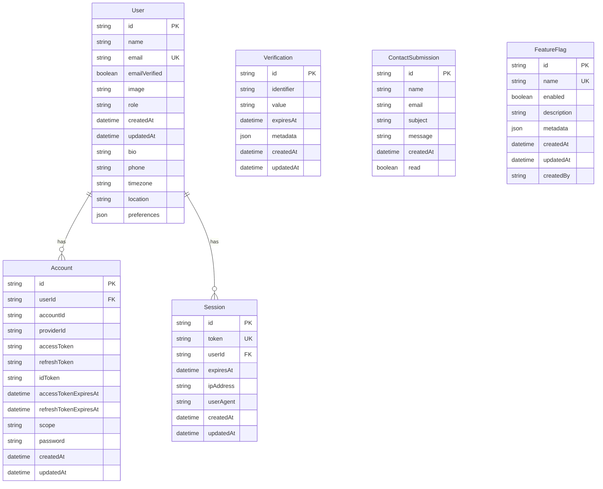

# Database Schema

## Database Design

Sunrise uses **PostgreSQL 15+** as the relational database with **Prisma ORM** for type-safe database access. The schema follows normalization principles while balancing query performance and development velocity.

## Entity Relationship Diagram


```mermaid
erDiagram
    User ||--o{ Account : "has"
    User ||--o{ Session : "has"
    User {
        string id PK
        string name
        string email UK
        boolean emailVerified
        string image
        string role
        datetime createdAt
        datetime updatedAt
        string bio
        string phone
        string timezone
        string location
        json preferences
    }

    Account {
        string id PK
        string userId FK
        string accountId
        string providerId
        string accessToken
        string refreshToken
        string idToken
        datetime accessTokenExpiresAt
        datetime refreshTokenExpiresAt
        string scope
        string password
        datetime createdAt
        datetime updatedAt
    }

    Session {
        string id PK
        string token UK
        string userId FK
        datetime expiresAt
        string ipAddress
        string userAgent
        datetime createdAt
        datetime updatedAt
    }

    Verification {
        string id PK
        string identifier
        string value
        datetime expiresAt
        json metadata
        datetime createdAt
        datetime updatedAt
    }

    ContactSubmission {
        string id PK
        string name
        string email
        string subject
        string message
        datetime createdAt
        boolean read
    }

    FeatureFlag {
        string id PK
        string name UK
        boolean enabled
        string description
        json metadata
        datetime createdAt
        datetime updatedAt
        string createdBy
    }
```

## PostgreSQL Extensions

Sunrise uses Prisma's `postgresqlExtensions` preview feature to declare required PostgreSQL extensions directly in the schema:

```prisma
generator client {
  provider        = "prisma-client-js"
  previewFeatures = ["postgresqlExtensions"]
}

datasource db {
  provider   = "postgresql"
  extensions = [vector]
}
```

**Enabled extensions:**

| Extension | Purpose                                                                                      |
| --------- | -------------------------------------------------------------------------------------------- |
| `vector`  | pgvector — stores embeddings for the Agent Orchestration knowledge base (`AiKnowledgeChunk`) |

The extension must be available on the PostgreSQL server before migrations run. See [migrations.md](./migrations.md#pgvector) for install instructions per environment.

## Prisma 7 Configuration

Prisma 7 uses a TypeScript configuration file (`prisma.config.ts`) instead of relying solely on environment variables at build time.

### Configuration File

```typescript
// prisma.config.ts
import { config } from 'dotenv';
import { defineConfig, env } from 'prisma/config';

// Load .env.local first (for Next.js local development), then .env as fallback
config({ path: '.env.local' });
config({ path: '.env' });

export default defineConfig({
  schema: 'prisma/schema.prisma',
  migrations: {
    path: 'prisma/migrations',
  },
  datasource: {
    url: env('DATABASE_URL'),
  },
});
```

**Key points:**

- `.env.local` takes priority over `.env` (matches Next.js conventions)
- Configuration is type-safe with `defineConfig()`
- Migrations path is explicitly configured

### Prisma Client Setup

Prisma 7 requires a database adapter. The client singleton in `lib/db/client.ts`:

```typescript
import { PrismaClient } from '@prisma/client';
import { PrismaPg } from '@prisma/adapter-pg';
import { Pool } from 'pg';
import { env } from '@/lib/env';

const globalForPrisma = globalThis as unknown as {
  prisma: PrismaClient | undefined;
  pool: Pool | undefined;
};

// Create connection pool (reuse across hot reloads in development)
const pool = globalForPrisma.pool ?? new Pool({ connectionString: env.DATABASE_URL });

if (env.NODE_ENV !== 'production') globalForPrisma.pool = pool;

// Create Prisma adapter
const adapter = new PrismaPg(pool);

// Create Prisma client
export const prisma =
  globalForPrisma.prisma ??
  new PrismaClient({
    adapter,
    log: env.NODE_ENV === 'development' ? ['query', 'error', 'warn'] : ['error'],
  });

if (env.NODE_ENV !== 'production') globalForPrisma.prisma = prisma;
```

**Key differences from Prisma 6:**

- Requires `@prisma/adapter-pg` package
- Requires `pg` package for connection pooling
- Adapter must be passed to `PrismaClient` constructor
- Pool is managed separately for hot reload reuse

## Prisma Schema

The canonical schema is [`prisma/schema.prisma`](../../prisma/schema.prisma). Read it directly — this document covers design decisions, conventions, and rationale, not the schema definition itself.

## Schema Design Decisions

### Primary Keys: CUID vs UUID

**Decision**: Use CUID (`@default(cuid())`)

**Rationale**:

- Collision-resistant (like UUID)
- Sortable by creation time (unlike UUID v4)
- Shorter than UUID (25 chars vs 36)
- URL-safe characters

**Example**: `cmjbv4i3x00003wsloputgwul`

**Format**: `c[a-z0-9]{24}` (25 characters total, starts with 'c')

#### better-auth ID Generation Configuration

**Important**: By default, better-auth generates its own IDs (32-character format) instead of using Prisma's `@default(cuid())`. To ensure **consistent CUID format across all user creation methods**, better-auth is configured to delegate ID generation to Prisma:

```typescript
// lib/auth/config.ts
export const auth = betterAuth({
  // ... other config
  advanced: {
    database: {
      generateId: () => false, // Delegate to Prisma's @default(cuid())
    },
  },
});
```

**This ensures**:

- ✅ UI signup via better-auth → CUID format
- ✅ OAuth signup via better-auth → CUID format
- ✅ API user creation (delegates to better-auth) → CUID format
- ✅ Direct Prisma calls (seed script) → CUID format

Without this configuration, better-auth would generate 32-character IDs, resulting in inconsistent ID formats across the application.

### Timestamps

All models include:

- `createdAt`: Automatic timestamp on creation
- `updatedAt`: Automatic timestamp on every update

```prisma
createdAt DateTime @default(now())
updatedAt DateTime @updatedAt
```

### Nullable vs. Required Fields

**Required Fields** (not null):

- `name`: User display name (required at signup)
- `email`: Essential for user identification
- `role`: Every user must have a role (defaults to "USER")
- `emailVerified`: Boolean flag (defaults to false)
- `createdAt`, `updatedAt`: System-managed timestamps

**Nullable Fields** (`?`):

- `image`: Profile picture is optional
- `bio`, `phone`, `location`: Extended profile fields
- `password` (in Account): OAuth users don't have passwords
- `ipAddress`, `userAgent` (in Session): May not be available
- `metadata` (in Verification): Optional invitation details

### Cascading Deletes

```prisma
user User @relation(fields: [userId], references: [id], onDelete: Cascade)
```

**Strategy**: CASCADE for owned data

- Delete user → automatically delete accounts, sessions
- Prevents orphaned records
- Maintains referential integrity

**Alternative**: SET NULL for shared references

```prisma
// If posts should survive author deletion
author User @relation(fields: [authorId], references: [id], onDelete: SetNull)
```

## Indexes

### Purpose of Indexes

Indexes speed up queries but slow down writes. Index fields that are:

1. Used in WHERE clauses frequently
2. Used in ORDER BY clauses
3. Foreign keys
4. Unique constraints

### Index Strategy

```prisma
@@index([email])          // Fast user lookup by email
@@index([role])           // Fast filtering by role
@@index([userId])         // Fast joins and foreign key lookups
@@index([provider, providerAccountId])  // Compound index for OAuth
```

**Query Performance**:

- Without index: O(n) table scan
- With index: O(log n) B-tree search

### Unique Constraints

```prisma
email String @unique              // Single field unique
@@unique([provider, providerAccountId])  // Composite unique
```

**Purpose**:

- Enforce business rules (one email per user)
- Prevent duplicate OAuth connections
- Automatically creates index

## Model: FeatureFlag

The `FeatureFlag` model provides runtime feature toggle functionality for the admin dashboard. Administrators can enable or disable features without code deployments.

### Fields

| Field       | Type     | Constraints    | Description                                                       |
| ----------- | -------- | -------------- | ----------------------------------------------------------------- |
| id          | String   | PK, CUID       | Unique identifier                                                 |
| name        | String   | Unique         | Flag name in SCREAMING_SNAKE_CASE (e.g., `ENABLE_BETA_FEATURES`)  |
| enabled     | Boolean  | Default: false | Whether the feature is currently enabled                          |
| description | String?  | Text           | Human-readable description of what the flag controls              |
| metadata    | Json?    | Default: `{}`  | Additional configuration as JSON (rollout %, user segments, etc.) |
| createdAt   | DateTime | Default: now() | When the flag was created                                         |
| updatedAt   | DateTime | Auto-updated   | When the flag was last modified                                   |
| createdBy   | String?  | -              | User ID of the admin who created the flag                         |

### Indexes

- `@@index([name])` - Fast lookup by flag name for feature checks

### Usage

Feature flags are managed through the admin dashboard at `/admin/features`. The system supports:

- **Boolean toggles**: Simple on/off for features
- **Metadata storage**: JSON field for complex configurations (rollout percentages, user segments)
- **Audit trail**: `createdBy` tracks which admin created each flag

### Utilities

Feature flag utilities are in `lib/feature-flags/index.ts`. Use these instead of raw Prisma queries.

| Function                    | Purpose                         | Returns                        |
| --------------------------- | ------------------------------- | ------------------------------ |
| `isFeatureEnabled(name)`    | Check if flag enabled           | `Promise<boolean>`             |
| `getAllFlags()`             | Get all flags (sorted by name)  | `Promise<FeatureFlag[]>`       |
| `getFlag(name)`             | Get single flag by name         | `Promise<FeatureFlag \| null>` |
| `toggleFlag(name, enabled)` | Toggle flag state               | `Promise<FeatureFlag \| null>` |
| `createFlag(data)`          | Create new flag                 | `Promise<FeatureFlag>`         |
| `updateFlag(id, data)`      | Update flag by ID               | `Promise<FeatureFlag>`         |
| `deleteFlag(id)`            | Delete flag by ID               | `Promise<void>`                |
| `seedDefaultFlags()`        | Seed default flags (idempotent) | `Promise<void>`                |

**Usage examples**:

```typescript
import { isFeatureEnabled, getAllFlags, toggleFlag } from '@/lib/feature-flags';

// Check if a feature is enabled (returns false if not found)
if (await isFeatureEnabled('MAINTENANCE_MODE')) {
  return <MaintenancePage />;
}

// Get all flags for admin dashboard
const flags = await getAllFlags();

// Toggle a flag
await toggleFlag('ENABLE_BETA_FEATURES', true);
```

**Creating a flag**:

```typescript
import { createFlag } from '@/lib/feature-flags';

await createFlag({
  name: 'NEW_FEATURE', // Auto-uppercased
  description: 'Enables the new feature',
  enabled: false,
  metadata: { rolloutPercent: 10 },
  createdBy: userId,
});
```

**Error handling**: All utilities catch errors internally and log them. `isFeatureEnabled()` returns `false` on error, query functions return `null` or empty arrays.

## Agent Orchestration Models

The Agent Orchestration Layer adds 13 models under the `ai_*` table prefix. These are documented in detail in [models.md](./models.md#agent-orchestration-models). At a glance:

| Group            | Models                                         |
| ---------------- | ---------------------------------------------- |
| Agents           | `AiAgent`, `AiCapability`, `AiAgentCapability` |
| Workflows        | `AiWorkflow`, `AiWorkflowExecution`            |
| Conversations    | `AiConversation`, `AiMessage`                  |
| Knowledge base   | `AiKnowledgeDocument`, `AiKnowledgeChunk`      |
| Evaluation       | `AiEvaluationSession`, `AiEvaluationLog`       |
| Cost & providers | `AiCostLog`, `AiProviderConfig`                |

**Conventions:**

- **Snake-case tables, camel-case columns.** Model `AiKnowledgeChunk` maps to `ai_knowledge_chunk`, but columns like `chunkKey` and `fileHash` stay camelCase. In raw SQL, quote them: `WHERE "fileHash" = $1`.
- **No Prisma enums.** Status/role/type fields are plain `String` columns. Valid values live in `types/orchestration.ts` (`WorkflowStatus`, `MessageRole`, `EvaluationStatus`, `EventType`, `DocumentStatus`, `CostOperation`, `ProviderType`, `ExecutionType`).
- **CUID primary keys** — consistent with the rest of the schema.
- **Creator relations** — `User` has seven new reverse relations (`aiAgents`, `aiWorkflows`, `aiWorkflowExecutions`, `aiConversations`, `aiKnowledgeDocuments`, `aiEvaluationSessions`, `aiProviderConfigs`) for audit trails. Cost logs use `onDelete: SetNull` on their agent/conversation/workflow references so historical cost data survives parent deletion.

### Vector embeddings

`AiKnowledgeChunk.embedding` uses Prisma's `Unsupported` type to store pgvector data:

```prisma
embedding Unsupported("vector(1536)")?
```

**Implications:**

- The field is **not selectable through the Prisma client**. Queries against it must go through `prisma.$queryRaw` with the pgvector operators (`<=>` for cosine distance, `<->` for L2).
- The column is indexed with an HNSW index using `vector_cosine_ops` (m=16, ef_construction=64) for approximate nearest-neighbour search.
- Embeddings are 1536 dimensions, matching OpenAI's `text-embedding-3-small` output.

### Knowledge document deduplication

`ai_knowledge_document` has a **partial unique index** that prevents duplicate "ready" documents with the same content hash:

```sql
CREATE UNIQUE INDEX idx_knowledge_doc_file_hash_ready
ON ai_knowledge_document ("fileHash")
WHERE status = 'ready';
```

Failed uploads are excluded so callers can retry after a processing error. This is a belt-and-braces safeguard against concurrent uploads racing past the application-level dedup check.

## Table Naming Convention

```prisma
@@map("user")  // Table name in PostgreSQL
```

**Convention**: Singular snake_case (better-auth default)

- Model: `User` (PascalCase)
- Table: `user` (singular snake_case)
- Matches better-auth adapter expectations

## Data Types

### String Types

```prisma
name   String         // VARCHAR(255) default
bio    String @db.Text  // TEXT for long content
```

- `String`: Default VARCHAR(255)
- `@db.Text`: Unlimited length (use for long content)

### DateTime

```prisma
createdAt DateTime @default(now())
expires   DateTime
```

- Stored as TIMESTAMP WITH TIME ZONE
- UTC recommended for consistency

### Role Field

The `role` field uses a String type with application-level validation rather than a database enum:

```prisma
role String @default("USER")
```

**Why String instead of Enum**:

- Easier to add new roles without migrations
- better-auth compatibility (expects string role)
- Validation handled at application layer with Zod

**Valid role values**: `"USER"`, `"ADMIN"`

**Validation example**:

```typescript
import { z } from 'zod';

const roleSchema = z.enum(['USER', 'ADMIN']);
```

## Schema Evolution

### Adding New Fields

```prisma
// Safe: Add optional field
model User {
  // ... existing fields
  bio String?  // Nullable, no migration issues
}
```

```prisma
// Requires default or data migration
model User {
  // ... existing fields
  bio String @default("")  // Default value for existing rows
}
```

### Adding New Models

```prisma
// New model with relation to existing User
model Post {
  id        String   @id @default(cuid())
  title     String
  authorId  String
  createdAt DateTime @default(now())

  author User @relation(fields: [authorId], references: [id])

  @@index([authorId])
}

// Update User model to include relation
model User {
  // ... existing fields
  posts Post[]  // Add reverse relation
}
```

## Performance Considerations

### Connection Pooling

Prisma manages connection pooling automatically:

```prisma
datasource db {
  provider = "postgresql"
  url      = env("DATABASE_URL")
  // Default pool size: 10 connections
  // Adjust via connection string: ?connection_limit=20
}
```

**Recommended Settings**:

- Development: 5-10 connections
- Production: 10-20 connections (per instance)
- Formula: `pool_size = (core_count × 2) + effective_spindle_count`

### Query Optimization

```typescript
// Good: Select only needed fields
const user = await prisma.user.findUnique({
  where: { id },
  select: { id: true, name: true, email: true },
});

// Bad: Fetch entire row including password hash
const user = await prisma.user.findUnique({ where: { id } });

// Good: Eager loading with include (prevents N+1)
const users = await prisma.user.findMany({
  include: { posts: true },
});

// Bad: N+1 query problem
const users = await prisma.user.findMany();
for (const user of users) {
  const posts = await prisma.post.findMany({ where: { authorId: user.id } });
}
```

## Decision History & Trade-offs

### Prisma vs. TypeORM vs. Raw SQL

**Decision**: Prisma ORM
**Rationale**:

- Type-safe queries (generated types match schema exactly)
- Excellent developer experience (autocomplete, migrations)
- Prevents SQL injection by design
- Prisma Studio for database inspection

**Trade-offs**:

- Abstraction layer (slight performance overhead)
- Complex queries may require raw SQL
- Vendor-specific schema language

### PostgreSQL vs. MySQL

**Decision**: PostgreSQL
**Rationale**:

- Better JSON support (for future features)
- More powerful query capabilities (CTEs, window functions)
- Strong ACID compliance
- Better for complex applications

**Trade-offs**: Slightly higher resource usage than MySQL

### Soft Delete vs. Hard Delete

**Decision**: Hard delete (actual DELETE statements)
**Rationale**:

- GDPR compliance (right to erasure)
- Simpler queries (no WHERE deleted_at IS NULL everywhere)
- Smaller database size

**Trade-offs**: Can't recover deleted data

**Alternative Soft Delete Pattern**:

```prisma
model User {
  // ... fields
  deletedAt DateTime?

  @@index([deletedAt])
}

// Query only active users
const users = await prisma.user.findMany({
  where: { deletedAt: null },
});
```

## Security Considerations

### Never Select Passwords

```typescript
// ALWAYS exclude password field
const user = await prisma.user.findUnique({
  where: { email },
  select: {
    id: true,
    name: true,
    email: true,
    role: true,
    // password deliberately omitted
  },
});
```

### Parameterized Queries

Prisma automatically uses parameterized queries:

```typescript
// Safe: Prisma parameterizes automatically
const user = await prisma.user.findUnique({
  where: { email: userInput },
});

// Equivalent SQL:
// SELECT * FROM users WHERE email = $1

// If you must use raw SQL:
const users = await prisma.$queryRaw`
  SELECT * FROM users WHERE email = ${userInput}
`;
// Prisma still parameterizes even in raw queries
```

## Related Documentation

- [Database Models](./models.md) - Prisma model usage patterns
- [Database Migrations](./migrations.md) - Migration workflow
- [API Endpoints](../api/endpoints.md) - Using database in API routes
- [Architecture Dependencies](../architecture/dependencies.md) - Database client setup
